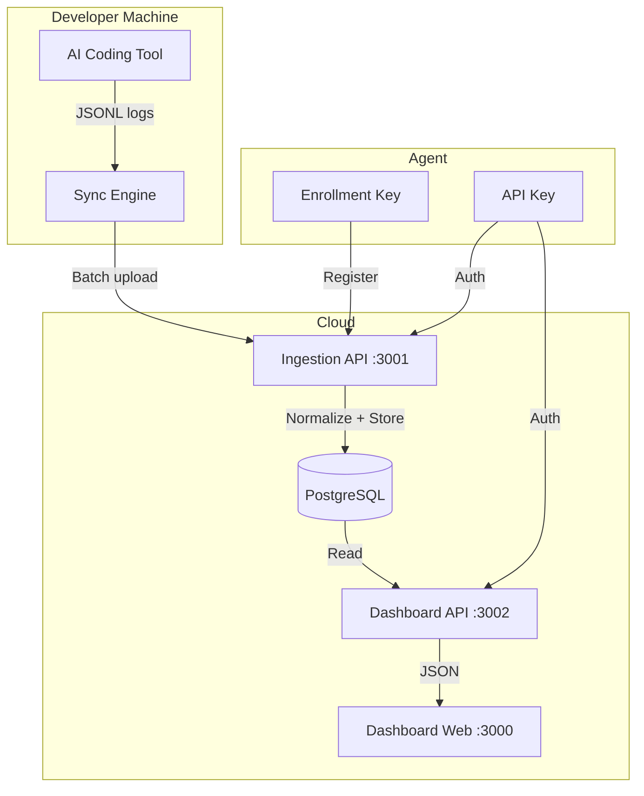

# AIInsight

**See where your AI coding tokens go — by task, tool, model, and project.**

AIInsight tracks token usage across Claude, Codex, Cursor, and Gemini. It runs locally, syncs to a self-hosted dashboard, and gives you per-task cost visibility that AI coding tools don't provide.

---

## Features

- **Multi-provider tracking** — Claude, Codex, Cursor, Gemini, and 27+ more providers
- **Per-task cost breakdown** — See cost by session, model, project, and user
- **Incremental sync** — Watermark-based sync uploads only new calls; checksum deduplication prevents re-processing
- **Self-hosted dashboard** — Next.js web app with real-time analytics
- **Multi-user** — Organizations, teams, roles, and invitation flow
- **API key management** — Create, revoke, and manage API keys for agent authentication
- **Machine monitoring** — Track agent machines with heartbeat and offline detection
- **Session analytics** — Drill into individual sessions with full event timelines

---

## Architecture



### Components

| Component | Port | Purpose |
|-----------|------|---------|
| **Sync Engine** | — | Runs on developer machine, reads local JSONL logs, normalizes and uploads |
| **Ingestion API** | 3001 | Receives batch uploads, normalizes data, stores in PostgreSQL |
| **Dashboard API** | 3002 | Auth, organizations, invitations, analytics queries, agent management |
| **Dashboard Web** | 3000 | Next.js frontend for viewing analytics |
| **PostgreSQL** | 5432 | Data store for all normalized data |

---

## Quick Start

### 1. Clone and install

```bash
git clone https://github.com/getagentseal/codeburn.git
cd aiinsight
npm install
```

### 2. Start the stack

```bash
docker compose up -d          # PostgreSQL
npm run api:migrate           # Run database migrations
npm run api:dev               # Ingestion API on :3001
npm run dashboard-api:dev     # Dashboard API on :3002
npm run dashboard-web:dev     # Dashboard Web on :3000
```

### 3. Create your account

Open `http://localhost:3000/register` and sign up. An organization is created automatically.

### 4. Generate an API key

Navigate to **Settings** in the dashboard and create an API key.

### 5. Install and run the agent

```bash
npm install -g aiinsight
aiinsight login                # Paste your API key when prompted
aiinsight sync                 # Run sync
```

### 6. View your data

Open `http://localhost:3000/dashboard` to see your token usage analytics.

---

## User Flow

```
Register
    ↓
Generate API Key
    ↓
aiinsight login
    ↓
aiinsight sync
    ↓
Dashboard
```

---

## Technology Stack

| Layer | Technology |
|-------|------------|
| Frontend | Next.js 15, React 19, TypeScript, Tailwind CSS |
| Backend | Express.js, TypeScript, Node.js 22+ |
| Database | PostgreSQL 16 |
| Auth | JWT (HS256), Argon2 password hashing, refresh tokens |
| Sync | Custom sync engine with provider adapters |
| Email | Resend or SMTP |
| Logging | Pino |
| Testing | Vitest |

---

## Repository Structure

```
aiinsight/
├── apps/
│   ├── dashboard-api/        # Express API (auth, orgs, analytics)
│   ├── dashboard-web/        # Next.js frontend
│   └── ingestion-api/        # Express API (data ingestion)
├── packages/
│   ├── sync-engine/          # Core sync logic, provider adapters
│   └── analytics-engine/     # Aggregation queries
├── src/                      # CLI entry point (OSS agent)
├── tests/                    # Integration tests
├── docs/                     # Documentation
└── scripts/                  # Build and dev scripts
```

---

## Documentation

| Document | Description |
|----------|-------------|
| [Getting Started](docs/getting-started/getting-started.md) | User onboarding guide |
| [Install Agent](docs/getting-started/install-agent.md) | Platform-specific install |
| [CLI Reference](docs/cli/command-reference.md) | All CLI commands |
| [Architecture](docs/architecture/overview.md) | System design |
| [API Reference](docs/api/dashboard-api.md) | API documentation |
| [Developer Setup](docs/developer/setup.md) | Local development |
| [Operations](docs/operations/deployment.md) | Deployment guide |
| [FAQ](docs/getting-started/faq.md) | Common questions |

---

## Supported Providers

| Provider | Parser | Cloud Sync |
|----------|--------|------------|
| Claude Code | ✅ | ✅ |
| Codex CLI | ✅ | ✅ |
| Cursor | ✅ | ✅ |
| Gemini CLI | ✅ | ✅ |
| Warp | ✅ | ❌ (CLI only) |
| OpenCode | ✅ | ❌ (CLI only) |

See [Provider Docs](docs/providers/README.md) for the full list of 30+ providers.

---

## License

MIT

## Author

Sumit Maiti
