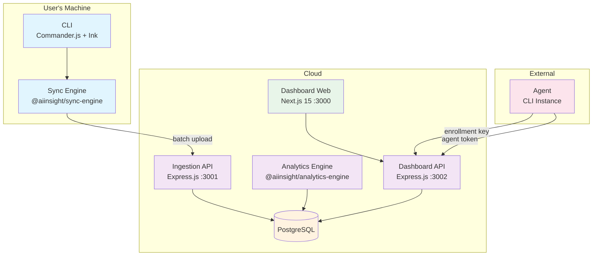
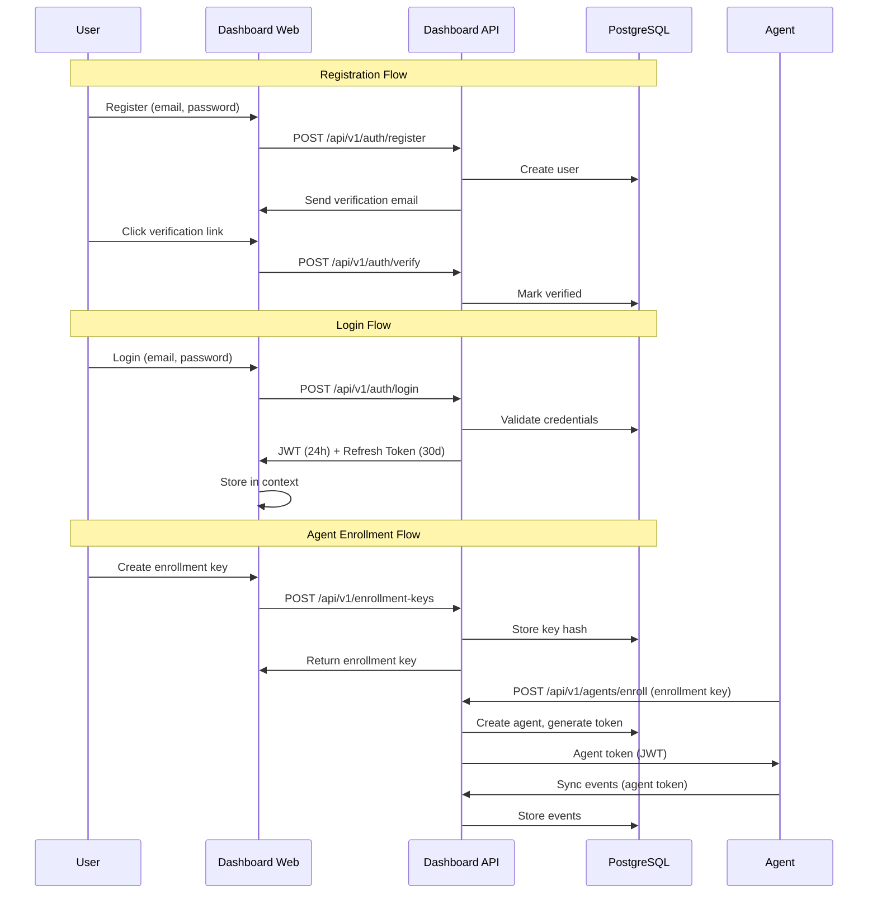
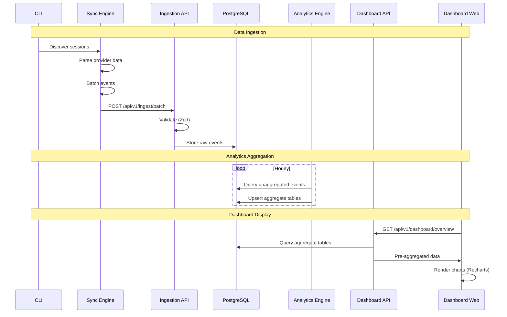

# AiInsight Architecture

A map of the codebase. Read this once before opening a non-trivial PR.

## System Overview

AiInsight is a comprehensive AI coding cost management platform with 6 components:

1. **CLI** - Command-line interface for local usage analysis
2. **Sync Engine** - Client-side library for cloud synchronization
3. **Ingestion API** - Multi-tenant REST API for event storage
4. **Analytics Engine** - Core aggregation library for usage summaries
5. **Dashboard API** - REST API for analytics data
6. **Dashboard Web** - Next.js frontend for visualization

The project is organized as a monorepo with npm workspaces:

```
aiinsight/
├── src/                          # CLI source (OSS)
├── packages/
│   ├── sync-engine/              # Client-side sync library
│   └── analytics-engine/         # Core aggregation library
├── apps/
│   ├── ingestion-api/            # Event ingestion REST API
│   ├── dashboard-api/            # Analytics REST API
│   └── dashboard-web/            # Next.js frontend
├── mac/                          # macOS menubar app (Swift)
├── gnome/                        # GNOME extension (JavaScript)
└── docs/                         # Documentation
```

## Architecture Diagram



## Component Details

### CLI (`src/`)

Commander.js + Ink (React for terminals) command-line interface.

**Commands:**

| Command | Purpose |
|---------|---------|
| `report` | Default. Interactive Ink TUI dashboard |
| `today` | Today-only view of report |
| `month` | Month-only view of report |
| `export` | CSV or JSON dump of usage data |
| `status` | Compact text status, `--format menubar-json` for clients |
| `optimize` | Runs all 14 waste detectors |
| `compare` | Compares two models side by side |
| `yield` | Tracks sessions shipped vs reverted (experimental) |
| `menubar` | Downloads and launches macOS menubar bundle |
| `currency` | Sets display currency |
| `model-alias` | Maps unknown model names for pricing |
| `plan` | Configures subscription plan for overage tracking |

**31 Provider Adapters:**

| Tier | Providers |
|------|-----------|
| **Core** (19) | claude, cline, codebuff, codex, copilot, devin, droid, gemini, ibm-bob, kilo-code, kiro, kimi, mistral-vibe, mux, openclaw, pi/omp, qwen, roo-code |
| **Lazy** (12) | antigravity, cursor, cursor-agent, crush, forge, goose, opencode, vercel-gateway, warp |

**Pipeline:**

```
provider.discoverSessions()
        ↓
provider.createSessionParser(source, seenKeys)
        ↓
src/parser.ts: parseAllSessions()
        ↓
src/daily-cache.ts: aggregate per day, persist
        ↓
output formatter (Ink TUI, JSON, or menubar-json)
```

### Sync Engine (`packages/sync-engine/`)

Client-side library that discovers, parses, and uploads provider session data to the cloud ingestion API.

**Features:**
- Discovers sessions from provider directories
- Batches events for upload with queue persistence
- Exponential backoff retry logic
- Historical + incremental sync loop
- File-based state tracking

**Structure:**
```
packages/sync-engine/src/
├── index.ts                    # SyncEngine class, exports
├── api-client/
│   └── ingestion.client.ts     # HTTP client for API calls
├── providers/
│   ├── index.ts                # Adapter registry
│   ├── claude.sync.ts          # Claude adapter
│   ├── codex.sync.ts           # Codex adapter
│   ├── cursor.sync.ts          # Cursor adapter
│   └── gemini.sync.ts          # Gemini adapter
├── scheduler/
│   └── syncLoop.ts             # Historical + incremental loop
├── services/
│   ├── historicalSync.service.ts
│   └── incrementalSync.service.ts
├── state/
│   └── syncState.repository.ts # Local file-based state
├── types/
│   └── sync.types.ts           # All TypeScript interfaces
└── uploader/
    └── batchUploader.ts        # Queue + retry + HTTP upload
```

### Ingestion API (`apps/ingestion-api/`)

Multi-tenant REST API that receives, validates, deduplicates, and stores usage events in PostgreSQL.

**Features:**
- Express.js, port 3001
- Zod validation for request schemas
- Multi-tenant via organization_id
- OpenAPI/Swagger documentation at `/api/docs`
- Agent authentication middleware

**Endpoints:**
- `POST /api/v1/ingest/batch` - Batch event ingestion
- `POST /api/v1/ingest/sessions` - Session ingestion
- `POST /api/v1/ingest/events` - Event ingestion

**Structure:**
```
apps/ingestion-api/src/
├── index.ts                    # Express app setup
├── controllers/
│   └── ingestion.controller.ts # Request handlers
├── database/
│   ├── pool.ts                 # PostgreSQL connection pool
│   ├── migrate.ts              # Migration runner
│   └── migrations/
│       ├── 001_initial_schema.sql
│       ├── 002_sessions_events.sql
│       ├── 003_sync_tracking.sql
│       ├── 004_aggregation_runs.sql
│       ├── 005_daily_usage.sql
│       ├── 006_daily_provider_usage.sql
│       ├── 007_daily_model_usage.sql
│       ├── 008_daily_user_usage.sql
│       ├── 009_daily_project_usage.sql
│       └── 010_auth.sql
├── middlewares/
│   └── auth.middleware.ts      # Agent auth
├── repositories/
│   ├── event.repository.ts
│   ├── machine.repository.ts
│   ├── organization.repository.ts
│   ├── provider.repository.ts
│   ├── session.repository.ts
│   ├── syncSource.repository.ts
│   ├── syncState.repository.ts
│   └── user.repository.ts
├── routes/
│   ├── health.route.ts
│   ├── ingestion.routes.ts
│   └── openapi.route.ts
└── validators/
    └── ingestion.validator.ts  # Zod schemas
```

### Analytics Engine (`packages/analytics-engine/`)

Core aggregation library that computes daily usage summaries from raw events.

**5 Aggregation Jobs:**
1. `daily_usage` - Org-level daily summary
2. `daily_provider_usage` - Per-provider daily summary
3. `daily_model_usage` - Per-model daily summary
4. `daily_user_usage` - Per-user daily summary
5. `daily_project_usage` - Per-project daily summary

**Features:**
- Hourly incremental updates (yesterday's data)
- Historical backfill on demand
- Idempotent upserts (ON CONFLICT DO UPDATE)
- Resume capability via aggregation_runs table

**Structure:**
```
packages/analytics-engine/src/
├── index.ts                         # Public exports
├── aggregators/
│   ├── dailyUsageAggregator.ts      # Org-level daily summary
│   ├── providerUsageAggregator.ts   # Per-provider daily summary
│   ├── modelUsageAggregator.ts      # Per-model daily summary
│   ├── userUsageAggregator.ts       # Per-user daily summary
│   └── projectUsageAggregator.ts    # Per-project daily summary
├── jobs/
│   ├── dailyAggregation.job.ts      # Hourly aggregation for yesterday
│   └── historicalBackfill.job.ts    # Backfill historical data
├── logging/
│   └── analytics.logger.ts          # Pino logger with context
├── repositories/
│   └── analytics.repository.ts      # Database queries
├── services/
│   └── analytics.service.ts         # Service facade
└── types/
    └── analytics.types.ts           # TypeScript interfaces
```

### Dashboard API (`apps/dashboard-api/`)

Express REST API serving pre-aggregated analytics data with JWT and API key authentication.

**Features:**
- Express.js, port 3002
- JWT + API key dual authentication
- Multi-tenant data isolation
- Comprehensive route coverage

**Routes:**
- `/api/v1/auth` - Login, refresh, register
- `/api/v1/organizations` - Organization management
- `/api/v1/teams` - Team management
- `/api/v1/invitations` - Invitation system
- `/api/v1/enrollment-keys` - Agent enrollment keys
- `/api/v1/agents` - Agent management
- `/api/v1/onboarding` - Onboarding progress
- `/api/v1/dashboard` - Analytics data

**Structure:**
```
apps/dashboard-api/src/
├── index.ts                         # Express app setup
├── controllers/
│   └── dashboard.controller.ts      # Request handlers
├── database/
│   └── pool.ts                      # PostgreSQL connection pool
├── logging/
│   └── dashboard.logger.ts          # Pino logger with context
├── middlewares/
│   └── auth.middleware.ts           # JWT + API key auth
├── repositories/
│   └── dashboard.repository.ts      # Read-only aggregate queries
├── routes/
│   ├── dashboard.routes.ts          # Dashboard endpoints
│   ├── auth.routes.ts               # Login/refresh endpoints
│   ├── organization.routes.ts       # Organization management
│   ├── team.routes.ts               # Team management
│   ├── invitation.routes.ts         # Invitation system
│   ├── enrollment.routes.ts         # Enrollment keys
│   ├── agent.routes.ts              # Agent management
│   ├── onboarding.routes.ts         # Onboarding progress
│   └── health.route.ts              # Health check
├── services/
│   └── dashboard.service.ts         # Business logic
└── validators/
    └── query.validator.ts           # Zod schemas
```

### Dashboard Web (`apps/dashboard-web/`)

Next.js 15 frontend for analytics visualization.

**Features:**
- Next.js 15 (App Router)
- React 19
- Tailwind CSS
- TanStack Query for data fetching
- Recharts for visualization

**Pages:**
- `/` - Landing page (marketing)
- `/login` - Login
- `/register` - Registration
- `/forgot-password` - Password reset request
- `/reset-password` - Password reset
- `/getting-started` - Onboarding wizard
- `/dashboard` - Overview dashboard
- `/providers` - Provider analytics
- `/models` - Model analytics
- `/users` - User analytics
- `/projects` - Project analytics
- `/trends` - Usage trends
- `/settings` - Organization settings
- `/settings/agents` - Agent setup and management

**Structure:**
```
apps/dashboard-web/src/
├── app/
│   ├── layout.tsx                   # Root layout with providers
│   ├── page.tsx                     # Landing page
│   ├── globals.css                  # Tailwind CSS
│   ├── login/page.tsx               # Login page
│   ├── register/page.tsx            # Registration page
│   ├── forgot-password/page.tsx     # Password reset request
│   ├── reset-password/page.tsx      # Password reset
│   ├── getting-started/page.tsx     # Onboarding wizard
│   ├── dashboard/page.tsx           # Overview dashboard
│   ├── providers/page.tsx           # Provider analytics
│   ├── models/page.tsx              # Model analytics
│   ├── users/page.tsx               # User analytics
│   ├── projects/page.tsx            # Project analytics
│   ├── trends/page.tsx              # Usage trends
│   ├── settings/page.tsx            # Organization settings
│   └── settings/agents/page.tsx     # Agent setup
├── components/
│   ├── DashboardShell.tsx           # Layout with nav
│   ├── PeriodSelector.tsx           # Period dropdown
│   ├── pages/                       # Page components
│   ├── ui/                          # Card, Select primitives
│   └── charts/                      # Recharts components
├── hooks/
│   └── useDashboard.ts             # TanStack Query hooks
├── lib/
│   ├── api.ts                       # API client
│   ├── auth-context.tsx            # Auth React context
│   └── utils.ts                     # Utility functions
└── types/
    └── dashboard.ts                 # TypeScript interfaces
```

### PostgreSQL

20+ tables across 13 migrations with multi-tenant isolation.

**Key Tables:**
- `organizations` - Tenant organizations
- `users` - User accounts
- `machines` - Registered machines/agents
- `sessions` - Usage sessions
- `events` - Raw usage events
- `daily_usage` - Precomputed daily summaries
- `daily_provider_usage` - Per-provider summaries
- `daily_model_usage` - Per-model summaries
- `daily_user_usage` - Per-user summaries
- `daily_project_usage` - Per-project summaries
- `enrollment_keys` - Agent enrollment keys
- `invitations` - User invitations
- `teams` - Team management
- `api_keys` - API key authentication

**Design:**
- Multi-tenant via organization_id foreign keys
- Precomputed aggregate tables for fast queries
- Idempotent upserts for safe reprocessing

## Authentication Flow



## Data Flow



## Deployment

### Docker Compose

```yaml
services:
  postgres:
    image: postgres:16-alpine
    ports:
      - "5432:5432"
    volumes:
      - postgres_data:/var/lib/postgresql/data

  ingestion-api:
    build: apps/ingestion-api
    ports:
      - "3001:3001"
    depends_on:
      postgres:
        condition: service_healthy

  dashboard-api:
    build: apps/dashboard-api
    ports:
      - "3002:3002"
    depends_on:
      postgres:
        condition: service_healthy

  dashboard-web:
    build: apps/dashboard-web
    ports:
      - "3000:3000"
    depends_on:
      - dashboard-api
```

### Environment Variables

| Variable | Description | Default |
|----------|-------------|---------|
| `DATABASE_URL` | PostgreSQL connection string | - |
| `JWT_SECRET` | Secret for JWT signing | - |
| `JWT_REFRESH_SECRET` | Secret for refresh tokens | - |
| `RESEND_API_KEY` | Resend email API key | - |
| `SMTP_HOST` | SMTP server host | - |
| `SMTP_PORT` | SMTP server port | 587 |
| `SMTP_USER` | SMTP username | - |
| `SMTP_PASS` | SMTP password | - |
| `PORT` | API port (per service) | 3001/3002 |

### Port Mapping

| Service | Port | URL |
|---------|------|-----|
| Dashboard Web | 3000 | http://localhost:3000 |
| Ingestion API | 3001 | http://localhost:3001 |
| Dashboard API | 3002 | http://localhost:3002 |
| PostgreSQL | 5432 | localhost:5432 |

## Architectural Decisions

| ADR | Decision | Rationale |
|-----|----------|-----------|
| ADR-001 | Separate analytics bounded context | Clear separation of concerns, independent scaling |
| ADR-002 | Precomputed aggregate tables | Sub-500ms dashboard response times |
| ADR-003 | JWT + API key dual authentication | Supports web users and machine-to-machine |
| ADR-004 | Next.js 15 + TanStack Query | Modern patterns, automatic caching |
| ADR-005 | Idempotent aggregation jobs | Safe reruns, graceful failure handling |
| ADR-006 | Hourly incremental + historical backfill | Fresh data + backfill capability |

## Related Documentation

- [Roadmap](roadmap.md) - Phase timeline and milestones
- [ADR-001](adr/ADR-001-separate-analytics-bounded-context.md) - Analytics bounded context
- [ADR-002](adr/ADR-002-precomputed-aggregate-tables.md) - Aggregate tables
- [ADR-003](adr/ADR-003-jwt-api-key-dual-authentication.md) - Authentication
- [ADR-004](adr/ADR-004-nextjs-15-tanstack-query.md) - Frontend stack
- [ADR-005](adr/ADR-005-idempotent-aggregation-jobs.md) - Idempotent jobs
- [ADR-006](adr/ADR-006-hourly-incremental-historical-backfill.md) - Aggregation pattern
- Phase 01: [Cloud Foundation](phases/phase-01-cloud-foundation.md)
- Phase 02: [Analytics Dashboard](phases/phase-02-analytics-dashboard.md)
- Phase 03: [Organization Onboarding](phases/phase-03-org-onboarding.md)
- Phase 3.5: [Activation & Onboarding](phases/phase-3.5-activation-onboarding.md)
