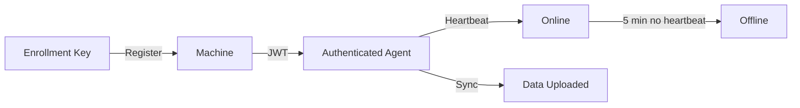
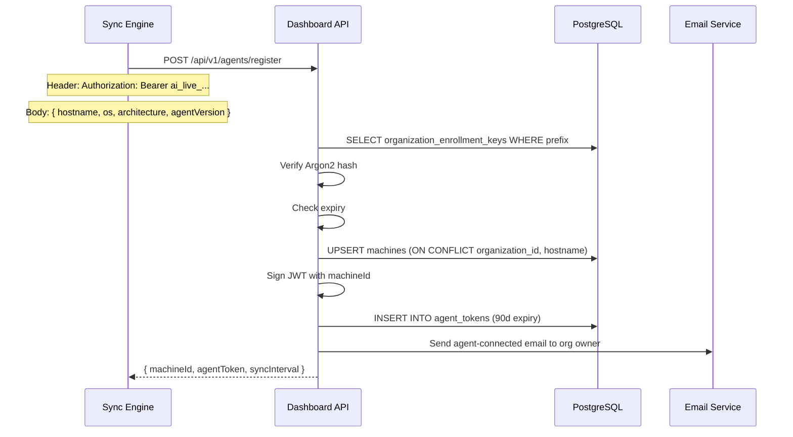
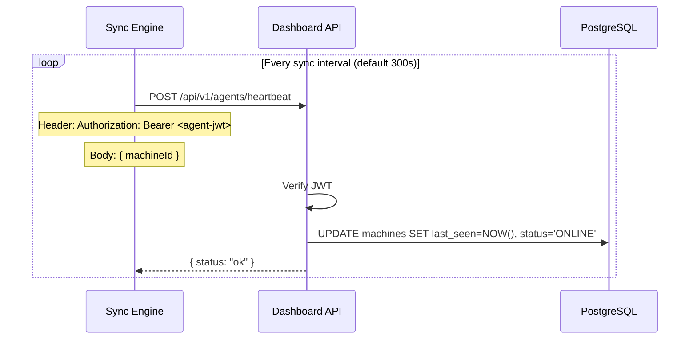
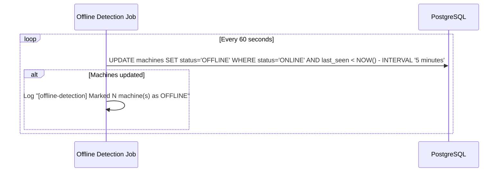
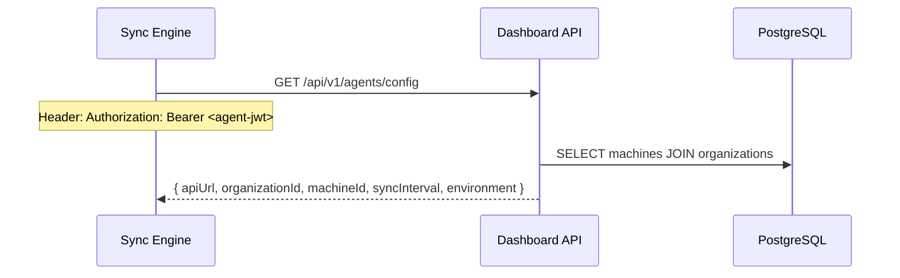
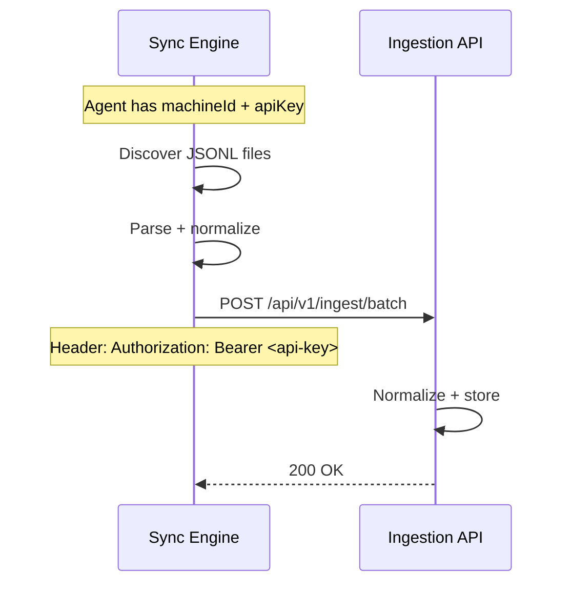

# Agent Lifecycle

## Overview

---

## Registration

### Machine Identity

Machines are identified by `(organization_id, hostname)`. If a machine with the same hostname registers again, its fields are updated (OS, architecture, version, status).

### Enrollment Key

- Format: `ai_live_XXXXXXXX_YYYYYYYYYYYYYYYYYYYYYYYYYYYYYYYYYYYYYYYYYYYYYYYY`
- Stored as Argon2 hash
- Optional expiry
- Can be revoked or rotated via dashboard
- One enrollment key can register multiple machines

---

## Heartbeat

---

## Status Updates

Machine status is tracked in the `machines.status` column:

| Status | Meaning |
|--------|---------|
| `ONLINE` | Heartbeat received within last 5 minutes |
| `OFFLINE` | No heartbeat for more than 5 minutes |
| `UNKNOWN` | Initial state before first heartbeat |

---

## Offline Detection

A background job runs every 60 seconds on the Dashboard API:

The job starts automatically when the Dashboard API starts.

---

## Agent Configuration

Authenticated agents can retrieve their configuration:

---

## Agent Tokens

Agent tokens are JWTs issued during registration:

- Algorithm: HS256
- Expiry: 90 days
- Payload: `sub` (user ID), `orgId`, `role: "agent"`, `machineId`
- Stored as SHA-256 hash in `agent_tokens` table
- `last_used_at` updated on each heartbeat

---

## Data Flow After Registration

The sync engine uses the organization's API key (created via dashboard) to authenticate with the Ingestion API, not the agent token.

---

## Machine Detail

The `GET /api/v1/machines/:id` endpoint returns:

| Field | Description |
|-------|-------------|
| Machine info | hostname, os, architecture, agent_version, status, first_seen, last_seen |
| Usage metrics | total sessions, events, tokens, cost (from events table) |
| Recent sessions | Last 10 sessions with token/cost data |
| Cost by model | Aggregated cost per model |
| Cost over time | Daily cost trend (last 30 days) |
| Agent tokens | List of issued agent tokens with last_used_at |
