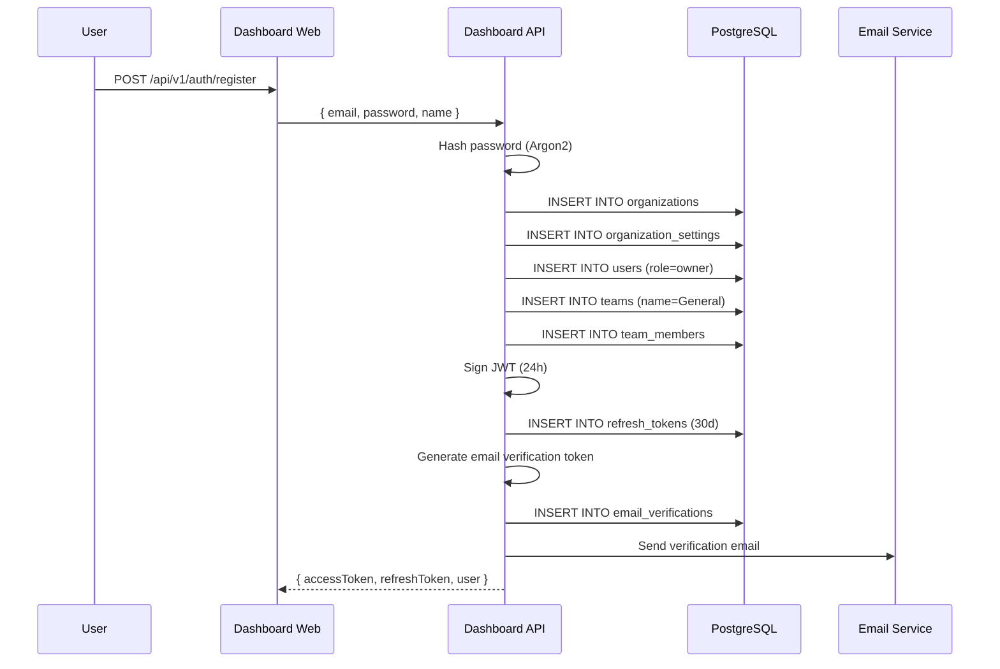
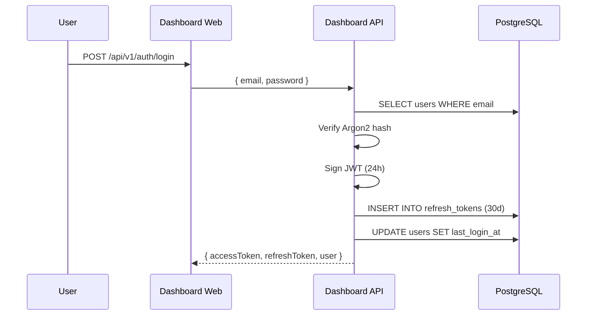
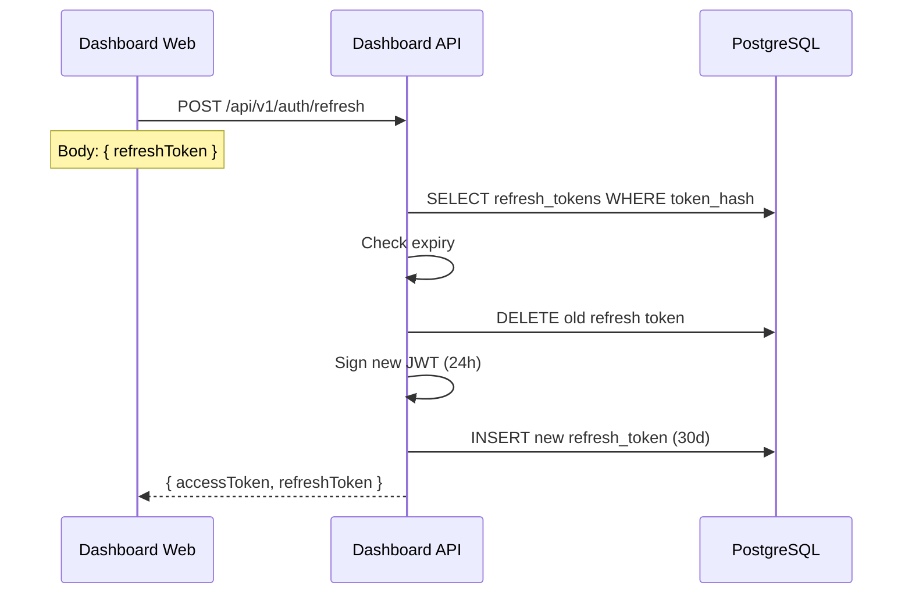
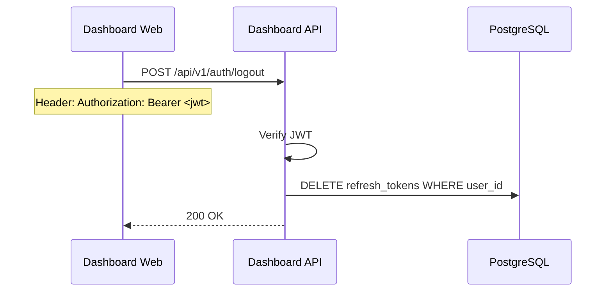
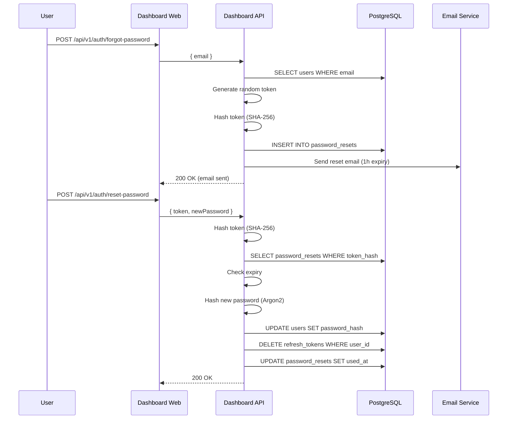
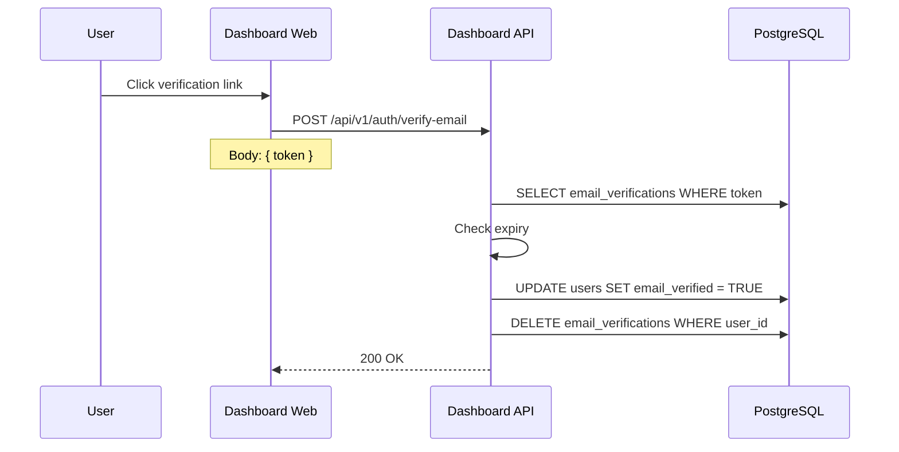
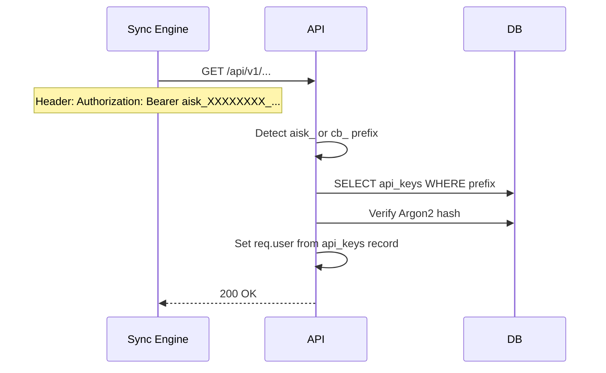
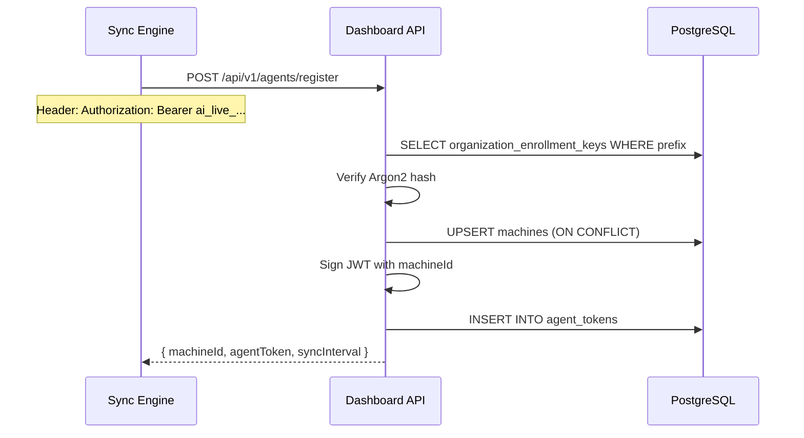

# Authentication Flow

## Registration

```mermaid
sequenceDiagram
    participant U as User
    participant DW as Dashboard Web
    participant DA as Dashboard API
    participant DB as PostgreSQL
    participant E as Email Service

    U->>DW: POST /api/v1/auth/register
    DW->>DA: { email, password, name }
    DA->>DA: Hash password (Argon2)
    DA->>DB: INSERT INTO organizations
    DA->>DB: INSERT INTO organization_settings
    DA->>DB: INSERT INTO users (role=owner)
    DA->>DB: INSERT INTO teams (name=General)
    DA->>DB: INSERT INTO team_members
    DA->>DA: Sign JWT (24h)
    DA->>DB: INSERT INTO refresh_tokens (30d)
    DA->>DA: Generate email verification token
    DA->>DB: INSERT INTO email_verifications
    DA->>E: Send verification email
    DA-->>DW: { accessToken, refreshToken, user }
```

## Login

```mermaid
sequenceDiagram
    participant U as User
    participant DW as Dashboard Web
    participant DA as Dashboard API
    participant DB as PostgreSQL

    U->>DW: POST /api/v1/auth/login
    DW->>DA: { email, password }
    DA->>DB: SELECT users WHERE email
    DA->>DA: Verify Argon2 hash
    DA->>DA: Sign JWT (24h)
    DA->>DB: INSERT INTO refresh_tokens (30d)
    DA->>DB: UPDATE users SET last_login_at
    DA-->>DW: { accessToken, refreshToken, user }
```

## Refresh Token

```mermaid
sequenceDiagram
    participant DW as Dashboard Web
    participant DA as Dashboard API
    participant DB as PostgreSQL

    DW->>DA: POST /api/v1/auth/refresh
    Note over DW: Body: { refreshToken }
    DA->>DB: SELECT refresh_tokens WHERE token_hash
    DA->>DA: Check expiry
    DA->>DB: DELETE old refresh token
    DA->>DA: Sign new JWT (24h)
    DA->>DB: INSERT new refresh_token (30d)
    DA-->>DW: { accessToken, refreshToken }
```

## Logout

```mermaid
sequenceDiagram
    participant DW as Dashboard Web
    participant DA as Dashboard API
    participant DB as PostgreSQL

    DW->>DA: POST /api/v1/auth/logout
    Note over DW: Header: Authorization: Bearer <jwt>
    DA->>DA: Verify JWT
    DA->>DB: DELETE refresh_tokens WHERE user_id
    DA-->>DW: 200 OK
```

## Password Reset

```mermaid
sequenceDiagram
    participant U as User
    participant DW as Dashboard Web
    participant DA as Dashboard API
    participant DB as PostgreSQL
    participant E as Email Service

    U->>DW: POST /api/v1/auth/forgot-password
    DW->>DA: { email }
    DA->>DB: SELECT users WHERE email
    DA->>DA: Generate random token
    DA->>DA: Hash token (SHA-256)
    DA->>DB: INSERT INTO password_resets
    DA->>E: Send reset email (1h expiry)
    DA-->>DW: 200 OK (email sent)

    U->>DW: POST /api/v1/auth/reset-password
    DW->>DA: { token, newPassword }
    DA->>DA: Hash token (SHA-256)
    DA->>DB: SELECT password_resets WHERE token_hash
    DA->>DA: Check expiry
    DA->>DA: Hash new password (Argon2)
    DA->>DB: UPDATE users SET password_hash
    DA->>DB: DELETE refresh_tokens WHERE user_id
    DA->>DB: UPDATE password_resets SET used_at
    DA-->>DW: 200 OK
```

## Email Verification

```mermaid
sequenceDiagram
    participant U as User
    participant DW as Dashboard Web
    participant DA as Dashboard API
    participant DB as PostgreSQL

    U->>DW: Click verification link
    DW->>DA: POST /api/v1/auth/verify-email
    Note over DW: Body: { token }
    DA->>DB: SELECT email_verifications WHERE token
    DA->>DA: Check expiry
    DA->>DB: UPDATE users SET email_verified = TRUE
    DA->>DB: DELETE email_verifications WHERE user_id
    DA-->>DW: 200 OK
```

## API Key Authentication

```mermaid
sequenceDiagram
    participant Agent as Sync Engine
    participant API as API

    Agent->>API: GET /api/v1/...
    Note over Agent: Header: Authorization: Bearer aisk_XXXXXXXX_...
    API->>API: Detect aisk_ or cb_ prefix
    API->>DB: SELECT api_keys WHERE prefix
    API->>DB: Verify Argon2 hash
    API->>API: Set req.user from api_keys record
    API-->>Agent: 200 OK
```

## Agent Registration

```mermaid
sequenceDiagram
    participant Agent as Sync Engine
    participant DA as Dashboard API
    participant DB as PostgreSQL

    Agent->>DA: POST /api/v1/agents/register
    Note over Agent: Header: Authorization: Bearer ai_live_...
    DA->>DB: SELECT organization_enrollment_keys WHERE prefix
    DA->>DA: Verify Argon2 hash
    DA->>DB: UPSERT machines (ON CONFLICT)
    DA->>DA: Sign JWT with machineId
    DA->>DB: INSERT INTO agent_tokens
    DA-->>Agent: { machineId, agentToken, syncInterval }
```
