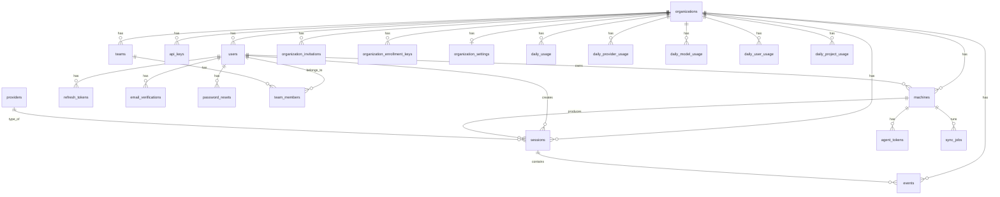

# Database Schema

PostgreSQL 16 with 14 migrations. All tables use UUID primary keys except `events` (BIGSERIAL) and `providers` (SMALLINT).

---

## Core Data Tables

### organizations

Top-level tenant boundary. Every other table is scoped to an organization.

| Column | Type | Constraints |
|--------|------|-------------|
| id | UUID | PRIMARY KEY, DEFAULT uuid_generate_v4() |
| name | TEXT | NOT NULL |
| created_at | TIMESTAMPTZ | NOT NULL, DEFAULT NOW() |

### users

Users belong to exactly one organization. Unique constraint on `(organization_id, email)`.

| Column | Type | Constraints |
|--------|------|-------------|
| id | UUID | PRIMARY KEY |
| organization_id | UUID | NOT NULL, FK → organizations(id) ON DELETE CASCADE |
| email | TEXT | NOT NULL |
| name | TEXT | |
| password_hash | TEXT | (added in migration 011) |
| role | TEXT | NOT NULL, DEFAULT 'user' — values: `user`, `org_admin`, `owner`, `admin`, `member` |
| email_verified | BOOLEAN | NOT NULL, DEFAULT FALSE (added in migration 012) |
| last_login_at | TIMESTAMPTZ | (added in migration 011) |
| created_at | TIMESTAMPTZ | NOT NULL, DEFAULT NOW() |

**Indexes**: `idx_users_org_id`, `idx_users_role`

### machines

Developer machines running the sync agent. Unique on `(organization_id, hostname)`.

| Column | Type | Constraints |
|--------|------|-------------|
| id | UUID | PRIMARY KEY |
| organization_id | UUID | NOT NULL, FK → organizations(id) ON DELETE CASCADE |
| user_id | UUID | NOT NULL, FK → users(id) ON DELETE CASCADE |
| hostname | TEXT | NOT NULL |
| os | TEXT | |
| architecture | TEXT | (added in migration 011) |
| agent_version | TEXT | (added in migration 011) |
| status | TEXT | NOT NULL, DEFAULT 'UNKNOWN' — values: `ONLINE`, `OFFLINE`, `UNKNOWN` |
| enrollment_key_id | UUID | FK → organization_enrollment_keys(id) (added in migration 011) |
| first_seen | TIMESTAMPTZ | NOT NULL, DEFAULT NOW() |
| last_seen | TIMESTAMPTZ | NOT NULL, DEFAULT NOW() |

**Indexes**: `idx_machines_org_id`, `idx_machines_user_id`, `idx_machines_status`

### providers

Reference data for supported AI coding tools. Seeded with 6 providers.

| Column | Type | Constraints |
|--------|------|-------------|
| id | SMALLINT | PRIMARY KEY |
| name | TEXT | NOT NULL, UNIQUE |

**Seeded data**: `1=claude`, `2=codex`, `3=cursor`, `4=gemini`, `5=warp`, `6=opencode`

### sessions

Normalized sessions from all providers. Unique on `(provider_id, external_session_id)`.

| Column | Type | Constraints |
|--------|------|-------------|
| id | UUID | PRIMARY KEY |
| organization_id | UUID | NOT NULL, FK → organizations(id) ON DELETE CASCADE |
| user_id | UUID | NOT NULL, FK → users(id) ON DELETE CASCADE |
| machine_id | UUID | NOT NULL, FK → machines(id) ON DELETE CASCADE |
| provider_id | SMALLINT | NOT NULL, FK → providers(id) ON DELETE RESTRICT |
| external_session_id | TEXT | NOT NULL |
| project_name | TEXT | |
| started_at | TIMESTAMPTZ | NOT NULL |
| ended_at | TIMESTAMPTZ | |
| raw_metadata | JSONB | |
| created_at | TIMESTAMPTZ | NOT NULL, DEFAULT NOW() |

**Indexes**: `idx_sessions_org_id`, `idx_sessions_machine_id`, `idx_sessions_provider_id`, `idx_sessions_started_at`, `idx_sessions_user_id`, `idx_sessions_org_started`, `idx_sessions_org_provider`, `idx_sessions_org_machine`

### events

Raw normalized event data. One row per API call. BIGSERIAL primary key for high-volume writes.

| Column | Type | Constraints |
|--------|------|-------------|
| id | BIGSERIAL | PRIMARY KEY |
| organization_id | UUID | NOT NULL, FK → organizations(id) ON DELETE CASCADE |
| session_id | UUID | NOT NULL, FK → sessions(id) ON DELETE CASCADE |
| event_time | TIMESTAMPTZ | NOT NULL |
| event_type | TEXT | NOT NULL |
| model | TEXT | NOT NULL |
| input_tokens | BIGINT | NOT NULL, DEFAULT 0 |
| output_tokens | BIGINT | NOT NULL, DEFAULT 0 |
| cache_read_tokens | BIGINT | NOT NULL, DEFAULT 0 |
| cache_write_tokens | BIGINT | NOT NULL, DEFAULT 0 |
| estimated_cost | NUMERIC(18,8) | NOT NULL, DEFAULT 0 |
| payload | JSONB | NOT NULL |

**Indexes**: `idx_events_org_id`, `idx_events_session_id`, `idx_events_event_time`, `idx_events_model`, `idx_events_event_type`, `idx_events_org_time`, `idx_events_session_time`, `idx_events_session_agg`, `idx_events_model` (org + model composite)

---

## Aggregation Tables

Pre-computed daily aggregates for fast dashboard queries.

### daily_usage

Organization-level daily totals.

| Column | Type | Constraints |
|--------|------|-------------|
| id | UUID | PRIMARY KEY |
| organization_id | UUID | NOT NULL, FK → organizations(id) |
| usage_date | DATE | NOT NULL |
| total_sessions | BIGINT | NOT NULL, DEFAULT 0 |
| total_users | BIGINT | NOT NULL, DEFAULT 0 |
| total_input_tokens | BIGINT | NOT NULL, DEFAULT 0 |
| total_output_tokens | BIGINT | NOT NULL, DEFAULT 0 |
| total_tokens | BIGINT | NOT NULL, DEFAULT 0 |
| total_cost | NUMERIC(18,8) | NOT NULL, DEFAULT 0 |

**Unique**: `(organization_id, usage_date)`

### daily_provider_usage

Per-provider daily totals.

| Column | Type | Constraints |
|--------|------|-------------|
| id | UUID | PRIMARY KEY |
| organization_id | UUID | NOT NULL, FK |
| provider_id | SMALLINT | NOT NULL, FK → providers(id) |
| usage_date | DATE | NOT NULL |
| total_sessions | BIGINT | NOT NULL, DEFAULT 0 |
| total_tokens | BIGINT | NOT NULL, DEFAULT 0 |
| total_cost | NUMERIC(18,8) | NOT NULL, DEFAULT 0 |

**Unique**: `(organization_id, provider_id, usage_date)`

### daily_model_usage

Per-model daily totals.

| Column | Type | Constraints |
|--------|------|-------------|
| id | UUID | PRIMARY KEY |
| organization_id | UUID | NOT NULL, FK |
| model | TEXT | NOT NULL |
| usage_date | DATE | NOT NULL |
| total_tokens | BIGINT | NOT NULL, DEFAULT 0 |
| total_cost | NUMERIC(18,8) | NOT NULL, DEFAULT 0 |
| session_count | BIGINT | NOT NULL, DEFAULT 0 |

**Unique**: `(organization_id, model, usage_date)`

### daily_user_usage

Per-user daily totals.

| Column | Type | Constraints |
|--------|------|-------------|
| id | UUID | PRIMARY KEY |
| organization_id | UUID | NOT NULL, FK |
| user_id | UUID | NOT NULL, FK → users(id) |
| usage_date | DATE | NOT NULL |
| session_count | BIGINT | NOT NULL, DEFAULT 0 |
| token_count | BIGINT | NOT NULL, DEFAULT 0 |
| cost | NUMERIC(18,8) | NOT NULL, DEFAULT 0 |

**Unique**: `(organization_id, user_id, usage_date)`

### daily_project_usage

Per-project daily totals.

| Column | Type | Constraints |
|--------|------|-------------|
| id | UUID | PRIMARY KEY |
| organization_id | UUID | NOT NULL, FK |
| project_name | TEXT | NOT NULL |
| usage_date | DATE | NOT NULL |
| session_count | BIGINT | NOT NULL, DEFAULT 0 |
| token_count | BIGINT | NOT NULL, DEFAULT 0 |
| cost | NUMERIC(18,8) | NOT NULL, DEFAULT 0 |

**Unique**: `(organization_id, project_name, usage_date)`

### aggregation_runs

Tracks aggregation job execution.

| Column | Type | Constraints |
|--------|------|-------------|
| id | UUID | PRIMARY KEY |
| organization_id | UUID | NOT NULL, FK |
| aggregation_type | TEXT | NOT NULL — `daily`, `historical_backfill` |
| started_at | TIMESTAMPTZ | NOT NULL, DEFAULT NOW() |
| completed_at | TIMESTAMPTZ | |
| status | TEXT | NOT NULL, DEFAULT `running` — `running`, `completed`, `failed` |
| records_processed | BIGINT | NOT NULL, DEFAULT 0 |
| error_message | TEXT | |

---

## Sync Tracking Tables

### sync_state

Tracks synchronization progress per source file. Used for checksum deduplication and timestamp watermarks.

| Column | Type | Constraints |
|--------|------|-------------|
| id | BIGSERIAL | PRIMARY KEY |
| organization_id | UUID | NOT NULL, FK |
| machine_id | UUID | NOT NULL, FK → machines(id) |
| provider | TEXT | NOT NULL |
| source_identifier | TEXT | NOT NULL |
| last_processed_at | TIMESTAMPTZ | |
| last_hash | TEXT | |
| last_call_timestamp | TEXT | (added in sync state, used for incremental watermark) |
| updated_at | TIMESTAMPTZ | NOT NULL, DEFAULT NOW() |

**Unique**: `(organization_id, machine_id, provider, source_identifier)`

### sync_sources

Tracks source files and their checksums.

| Column | Type | Constraints |
|--------|------|-------------|
| id | BIGSERIAL | PRIMARY KEY |
| machine_id | UUID | NOT NULL, FK → machines(id) |
| provider | TEXT | NOT NULL |
| source_path | TEXT | NOT NULL |
| file_size | BIGINT | NOT NULL, DEFAULT 0 |
| checksum | TEXT | |
| last_modified | TIMESTAMPTZ | |
| last_synced_at | TIMESTAMPTZ | |
| created_at | TIMESTAMPTZ | NOT NULL, DEFAULT NOW() |

**Unique**: `(machine_id, provider, source_path)`

---

## Auth Tables

### api_keys

Machine-to-machine authentication keys. Hashed with Argon2.

| Column | Type | Constraints |
|--------|------|-------------|
| id | UUID | PRIMARY KEY |
| organization_id | UUID | NOT NULL, FK |
| name | TEXT | NOT NULL |
| key_hash | TEXT | NOT NULL |
| prefix | TEXT | NOT NULL — format: `cb_XXXXXXXX` (8 hex chars) |
| role | TEXT | NOT NULL, DEFAULT `write` — `read`, `write`, `admin` |
| expires_at | TIMESTAMPTZ | |
| created_at | TIMESTAMPTZ | NOT NULL, DEFAULT NOW() |
| last_used_at | TIMESTAMPTZ | |

**Indexes**: `idx_api_keys_org_id`, `idx_api_keys_prefix`, `idx_api_keys_expires_at`

### refresh_tokens

Refresh tokens for user sessions. Hashed with SHA-256.

| Column | Type | Constraints |
|--------|------|-------------|
| id | UUID | PRIMARY KEY |
| user_id | UUID | NOT NULL, FK → users(id) ON DELETE CASCADE |
| token_hash | TEXT | NOT NULL |
| expires_at | TIMESTAMPTZ | NOT NULL |
| created_at | TIMESTAMPTZ | NOT NULL, DEFAULT NOW() |

**Indexes**: `idx_refresh_tokens_user_id`, `idx_refresh_tokens_expires_at`

### email_verifications

Email verification tokens. One-time use, 24h expiry.

| Column | Type | Constraints |
|--------|------|-------------|
| id | UUID | PRIMARY KEY |
| user_id | UUID | NOT NULL, FK → users(id) ON DELETE CASCADE |
| token | VARCHAR(64) | NOT NULL, UNIQUE |
| expires_at | TIMESTAMPTZ | NOT NULL |
| verified_at | TIMESTAMPTZ | |
| created_at | TIMESTAMPTZ | NOT NULL, DEFAULT NOW() |

### password_resets

Password reset tokens. One-time use, 1h expiry. Token stored as SHA-256 hash.

| Column | Type | Constraints |
|--------|------|-------------|
| id | UUID | PRIMARY KEY |
| user_id | UUID | NOT NULL, FK → users(id) ON DELETE CASCADE |
| token_hash | VARCHAR(64) | NOT NULL, UNIQUE |
| expires_at | TIMESTAMPTZ | NOT NULL |
| used_at | TIMESTAMPTZ | |
| created_at | TIMESTAMPTZ | NOT NULL, DEFAULT NOW() |

---

## Organization Tables

### organization_settings

One-to-one with organizations.

| Column | Type | Constraints |
|--------|------|-------------|
| id | UUID | PRIMARY KEY |
| organization_id | UUID | NOT NULL, UNIQUE, FK |
| timezone | TEXT | NOT NULL, DEFAULT `UTC` |
| currency | TEXT | NOT NULL, DEFAULT `USD` |
| retention_days | INTEGER | NOT NULL, DEFAULT 90 |
| created_at | TIMESTAMPTZ | NOT NULL, DEFAULT NOW() |
| updated_at | TIMESTAMPTZ | NOT NULL, DEFAULT NOW() |

### teams

| Column | Type | Constraints |
|--------|------|-------------|
| id | UUID | PRIMARY KEY |
| organization_id | UUID | NOT NULL, FK |
| name | TEXT | NOT NULL |
| description | TEXT | |
| created_at | TIMESTAMPTZ | NOT NULL, DEFAULT NOW() |

**Unique**: `(organization_id, name)`

### team_members

| Column | Type | Constraints |
|--------|------|-------------|
| id | UUID | PRIMARY KEY |
| team_id | UUID | NOT NULL, FK → teams(id) ON DELETE CASCADE |
| user_id | UUID | NOT NULL, FK → users(id) ON DELETE CASCADE |
| role | TEXT | NOT NULL, DEFAULT `member` |
| created_at | TIMESTAMPTZ | NOT NULL, DEFAULT NOW() |

**Unique**: `(team_id, user_id)`

### organization_invitations

| Column | Type | Constraints |
|--------|------|-------------|
| id | UUID | PRIMARY KEY |
| organization_id | UUID | NOT NULL, FK |
| email | TEXT | NOT NULL |
| role | TEXT | NOT NULL, DEFAULT `member` |
| token | TEXT | NOT NULL, UNIQUE |
| expires_at | TIMESTAMPTZ | NOT NULL |
| accepted_at | TIMESTAMPTZ | |
| created_at | TIMESTAMPTZ | NOT NULL, DEFAULT NOW() |

**Indexes**: `idx_invitations_org_id`, `idx_invitations_token`, `idx_invitations_email`

### organization_enrollment_keys

Used for agent registration. Hashed with Argon2.

| Column | Type | Constraints |
|--------|------|-------------|
| id | UUID | PRIMARY KEY |
| organization_id | UUID | NOT NULL, FK |
| name | TEXT | NOT NULL |
| key_hash | TEXT | NOT NULL |
| prefix | TEXT | NOT NULL — format: `ai_live_XXXXXXXX` |
| expires_at | TIMESTAMPTZ | |
| created_at | TIMESTAMPTZ | NOT NULL, DEFAULT NOW() |
| last_used_at | TIMESTAMPTZ | |

### agent_tokens

JWT tokens for authenticated agents.

| Column | Type | Constraints |
|--------|------|-------------|
| id | UUID | PRIMARY KEY |
| machine_id | UUID | NOT NULL, FK → machines(id) ON DELETE CASCADE |
| token_hash | VARCHAR(64) | NOT NULL, UNIQUE |
| created_at | TIMESTAMPTZ | NOT NULL, DEFAULT NOW() |
| expires_at | TIMESTAMPTZ | |
| last_used_at | TIMESTAMPTZ | |

### sync_jobs

Tracks sync job execution.

| Column | Type | Constraints |
|--------|------|-------------|
| id | UUID | PRIMARY KEY |
| machine_id | UUID | NOT NULL, FK → machines(id) ON DELETE CASCADE |
| provider | TEXT | NOT NULL |
| started_at | TIMESTAMPTZ | NOT NULL, DEFAULT NOW() |
| completed_at | TIMESTAMPTZ | |
| records_processed | INTEGER | NOT NULL, DEFAULT 0 |
| status | TEXT | NOT NULL, DEFAULT `RUNNING` |
| created_at | TIMESTAMPTZ | NOT NULL, DEFAULT NOW() |

---

## Entity Relationship Diagram

