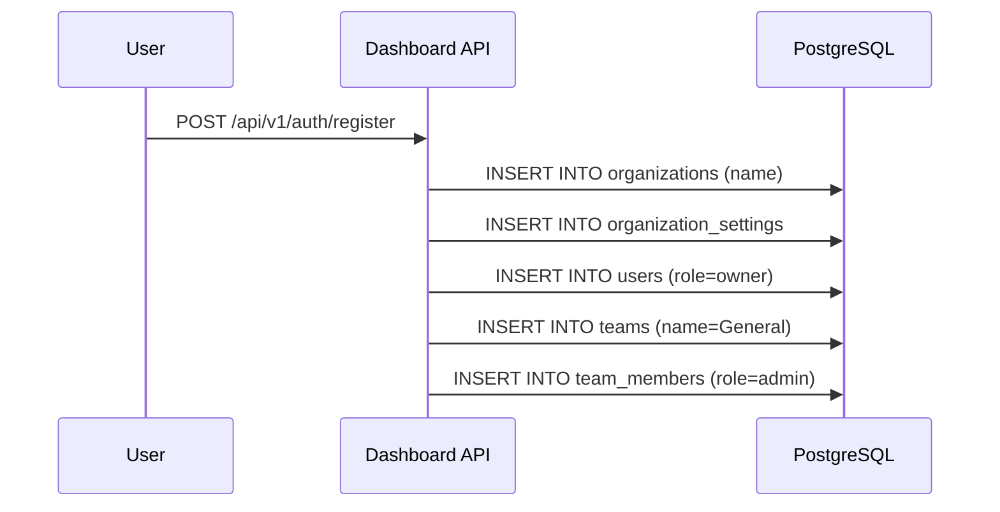
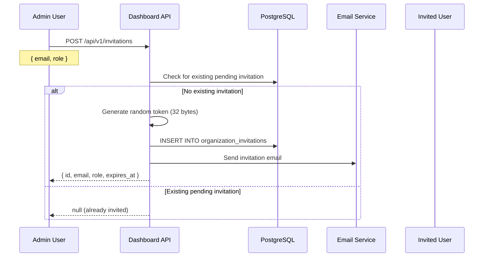
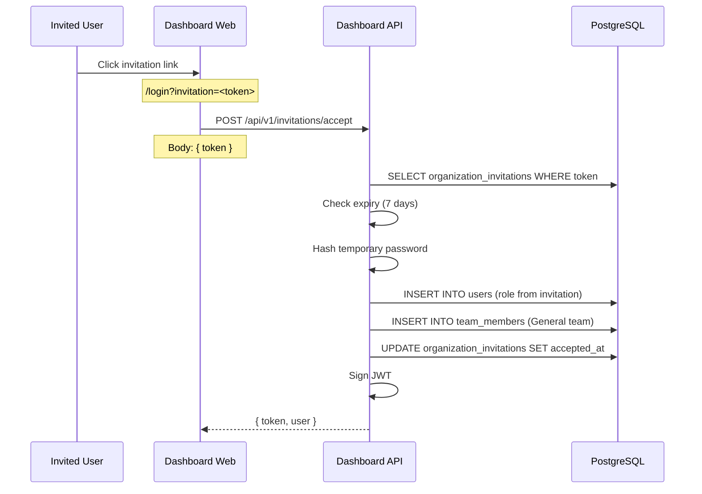
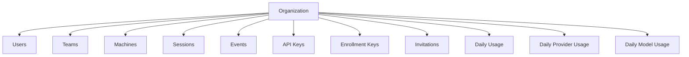
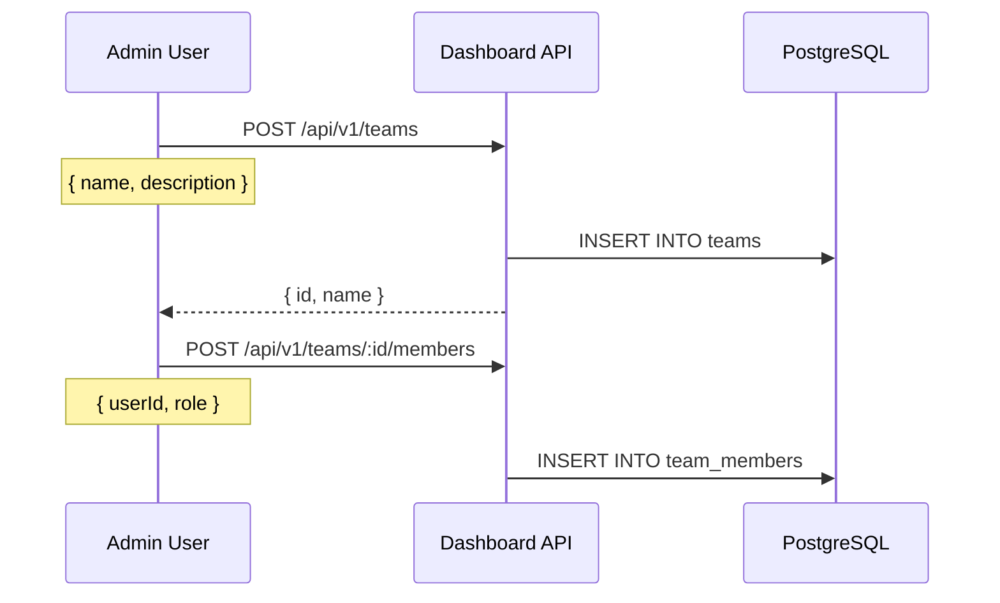

# Organization Flow

## Organization Creation

Organizations are created automatically during user registration.

The registering user becomes the `owner` of the organization.

---

## Member Invitation

Invitations expire after 7 days.

---

## Invitation Acceptance

---

## Roles

| Role | Description | Can Invite | Can Manage API Keys | Can Manage Teams | Can View Analytics |
|------|-------------|------------|---------------------|------------------|-------------------|
| `owner` | Full access | Yes | Yes | Yes | Yes |
| `admin` | Full access except org deletion | Yes | Yes | Yes | Yes |
| `org_admin` | Agent and analytics management | Yes | Yes | Yes | Yes |
| `member` | Basic access | No | No | No | Yes |

---

## Tenant Boundaries

All data is scoped to an organization:

No cross-organization queries exist. Every SQL query includes `WHERE organization_id = $1`.

---

## Team Management

Teams are optional groupings within an organization.

The default `General` team is created during organization setup. All invited users are automatically added to it.

---

## Onboarding Progress

The `GET /api/v1/onboarding/progress` endpoint tracks onboarding steps:

| Step | Field | Check |
|------|-------|-------|
| Organization created | `hasOrganization` | Always true (created during registration) |
| Users exist | `hasUsers` | `COUNT(*) > 0` in users table |
| Teams exist | `hasTeams` | `COUNT(*) > 0` in teams table |
| Enrollment keys exist | `hasEnrollmentKeys` | `COUNT(*) > 0` in organization_enrollment_keys |
| Machines registered | `hasMachines` | `COUNT(*) > 0` in machines |
| Sessions synced | `hasSessions` | `COUNT(*) > 0` in sessions |
