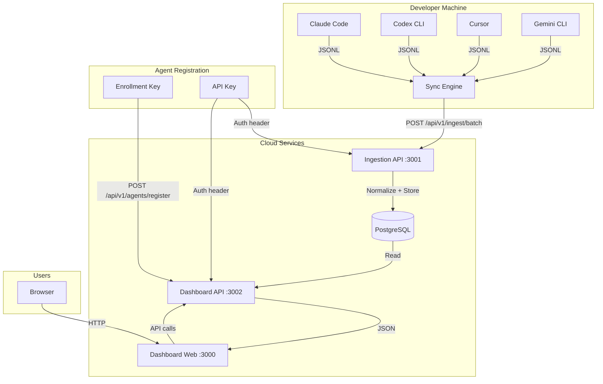
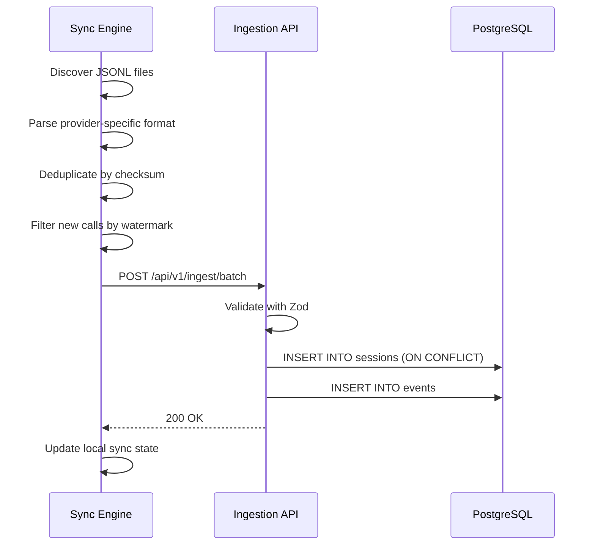
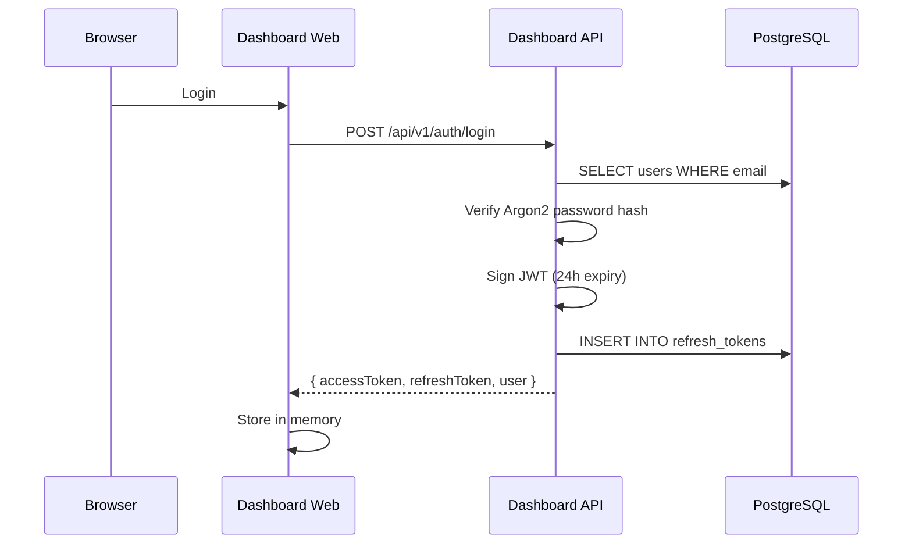
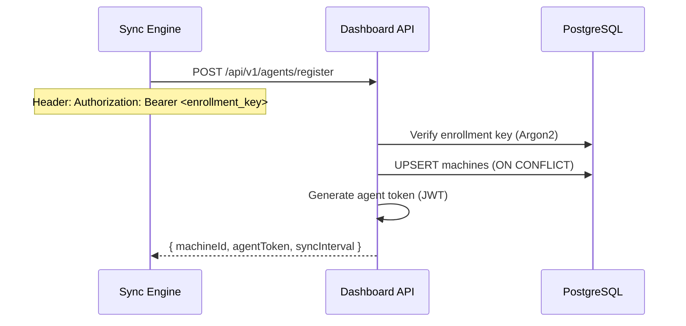

# Architecture Overview

## System Diagram

## Responsibilities

### Sync Engine

- Runs on the developer's machine
- Discovers JSONL log files from installed AI coding tools
- Parses provider-specific JSONL into normalized `ParsedProviderCall` objects
- Deduplicates by checksum and timestamp watermark
- Uploads batches to the Ingestion API with retry logic
- Persists upload queue to disk for durability

### Ingestion API (Port 3001)

- Receives batch uploads from sync engines
- Validates requests with Zod schemas
- Normalizes data into `sessions` and `events` tables
- Uses `ON CONFLICT` for session deduplication by `(provider_id, external_session_id)`
- Authenticates via JWT or `ai_` prefixed API keys
- Rate limited to 1000 requests/minute

### PostgreSQL

- Single data store for all normalized data
- Contains raw data (`sessions`, `events`) and pre-aggregated analytics tables (`daily_usage`, `daily_provider_usage`, `daily_model_usage`, `daily_user_usage`, `daily_project_usage`)
- Contains auth tables (`users`, `api_keys`, `refresh_tokens`, `email_verifications`, `password_resets`)
- Contains org/team tables (`organizations`, `teams`, `team_members`, `organization_invitations`)
- Contains agent tables (`machines`, `agent_tokens`, `organization_enrollment_keys`, `sync_jobs`)

### Dashboard API (Port 3002)

- JWT-based authentication with refresh token rotation
- API key authentication with Argon2 hashing
- Organization and team management
- Invitation flow with email dispatch
- Analytics queries against pre-aggregated tables
- Agent registration, heartbeat, and offline detection
- Session and machine detail endpoints
- Rate limited to 100 requests/minute on auth routes

### Dashboard Web (Port 3000)

- Next.js 15 application with App Router
- 9 analytics pages plus settings
- Real-time data from Dashboard API
- Responsive design with Tailwind CSS

---

## Data Flow

### 1. Sync Flow

### 2. Auth Flow

### 3. Agent Registration Flow

---

## Security Boundaries

- **External → Dashboard API**: JWT or API key auth required (except `/auth/register`, `/auth/login`, `/auth/refresh`, `/invitations/accept`)
- **External → Ingestion API**: JWT or `ai_` API key auth required
- **Dashboard Web → Dashboard API**: JWT in Authorization header
- **Sync Engine → Ingestion API**: `aisk_` API key (or `cb_` legacy) in Authorization header
- **Agent → Dashboard API**: Enrollment key for registration, JWT for subsequent calls

---

## Multi-Tenancy

Every data query filters by `organization_id`. Users belong to exactly one organization. Teams, machines, sessions, and events are all scoped to an organization. There is no cross-organization data access.
