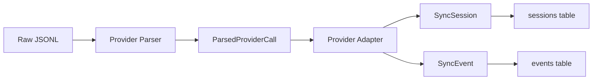

# Provider Model

AIInsight normalizes data from multiple AI coding tools into a unified schema. This document explains how.

---

## Why Normalization?

Each AI coding tool stores usage data differently:

- **Claude**: JSONL files with `costUSD`, `inputTokens`, `outputTokens`, `cacheReadInputTokens`, `cacheCreationInputTokens`
- **Codex**: JSONL files with similar fields but different naming
- **Cursor**: JSONL files with `usage` object containing token counts
- **Gemini**: JSONL files with `usageMetadata` containing token counts

Instead of creating provider-specific database tables, AIInsight normalizes all data into common `sessions` and `events` tables. This enables cross-provider analytics without schema proliferation.

---

## Data Flow



---

## ParsedProviderCall

The intermediate representation that all parsers produce:

```typescript
type ParsedProviderCall = {
  provider: string        // "claude", "codex", "cursor", "gemini"
  model: string           // "claude-sonnet-4-20250514", "gpt-4o", etc.
  inputTokens: number
  outputTokens: number
  cacheCreationInputTokens: number
  cacheReadInputTokens: number
  cachedInputTokens: number
  reasoningTokens: number
  webSearchRequests: number
  costUSD: number
  costIsEstimated?: boolean
  tools: string[]
  bashCommands: string[]
  timestamp: string
  speed: 'standard' | 'fast'
  deduplicationKey: string
  turnId?: string
  toolSequence?: ToolCall[][]
  userMessage: string
  sessionId: string
  project?: string
  projectPath?: string
}
```

---

## Provider Adapters

Each adapter implements `ProviderAdapter`:

```typescript
type ProviderAdapter = {
  name: string
  adaptSession(call: ParsedProviderCall): SyncSession
  adaptEvent(call: ParsedProviderCall): SyncEvent
}
```

### Claude Adapter

| Field | Source |
|-------|--------|
| `externalSessionId` | `call.sessionId` |
| `projectName` | `call.project` or `'unknown'` |
| `startedAt` | `call.timestamp` |
| `eventType` | `'completion'` (hardcoded) |
| `model` | `call.model` |
| `inputTokens` | `call.inputTokens` |
| `outputTokens` | `call.outputTokens` |
| `cacheReadTokens` | `call.cacheReadInputTokens` |
| `cacheWriteTokens` | `call.cacheCreationInputTokens` |
| `estimatedCost` | `call.costUSD` |
| `payload` | Full `ParsedProviderCall` object |

### Codex Adapter

Same structure as Claude, using the corresponding Codex JSONL fields.

### Cursor Adapter

Normalizes Cursor's `usage` object into the common token fields.

### Gemini Adapter

Normalizes Gemini's `usageMetadata` into the common token fields.

---

## SyncSession

Stored in the `sessions` table:

```typescript
type SyncSession = {
  externalSessionId: string   // Provider's session ID
  projectName: string         // Project name
  startedAt: string           // ISO timestamp
  endedAt?: string            // Not available from JSONL
  rawMetadata?: object        // Provider-specific metadata
}
```

---

## SyncEvent

Stored in the `events` table:

```typescript
type SyncEvent = {
  sessionId: string           // Links to session
  eventTime: string           // ISO timestamp
  eventType: string           // Always 'completion' in beta
  model: string               // Model name
  inputTokens: number
  outputTokens: number
  cacheReadTokens: number
  cacheWriteTokens: number
  estimatedCost: number       // USD
  payload: object             // Full ParsedProviderCall
}
```

---

## Cost Calculation

Cost is calculated by the provider's parser using published pricing:

- **Claude**: Uses `costUSD` from the JSONL if available, otherwise calculates from token counts and model pricing
- **Codex**: Uses `costUSD` from the JSONL
- **Cursor**: Uses `costUSD` from the JSONL
- **Gemini**: Calculates from token counts and model pricing

The `costIsEstimated` flag indicates whether the cost came from the provider's own calculation or was estimated from token counts.

---

## Payload Storage

The full `ParsedProviderCall` is stored as JSONB in the `events.payload` column. This preserves the original provider data for:

- Debugging sync issues
- Future analytics that need provider-specific fields
- Auditing and compliance

The payload is not queried for analytics — only the normalized fields (`input_tokens`, `output_tokens`, `estimated_cost`, etc.) are used.

---

## Why Not Provider-Specific Tables?

| Approach | Pros | Cons |
|----------|------|------|
| Provider-specific tables | Provider-specific fields are first-class | Schema proliferation, cross-provider queries require UNION ALL, adding a provider requires new tables |
| Normalized schema (chosen) | Single query for cross-provider analytics, adding a provider only requires a new adapter | Provider-specific fields are in JSONB payload |

The normalized approach was chosen because:

1. Cross-provider analytics are the primary use case
2. The core fields (tokens, cost, model, timestamp) are common across all providers
3. Provider-specific fields are preserved in the JSONB payload for future use
4. Adding a new provider requires only a parser + adapter, no schema changes
