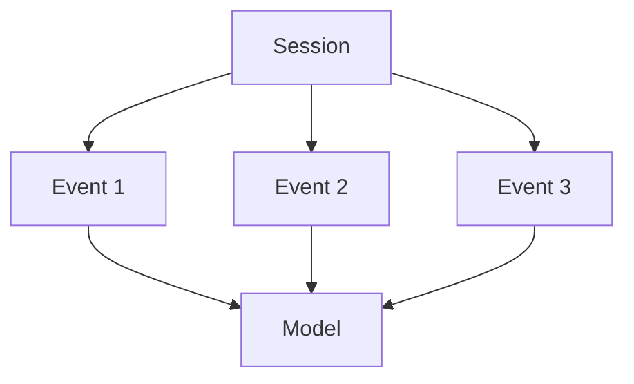
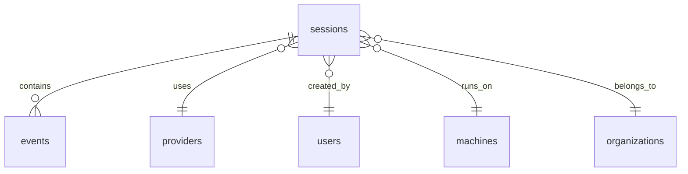

# Session Model

## Overview

A **session** represents a single interaction with an AI coding tool. An **event** represents a single API call within that session.



---

## Sessions

A session corresponds to a single JSONL source file (e.g., one Claude conversation).

| Field | Description |
|-------|-------------|
| `id` | Internal UUID |
| `external_session_id` | Provider's session identifier |
| `provider_id` | FK to providers table (1=claude, 2=codex, 3=cursor, 4=gemini) |
| `user_id` | FK to users table |
| `machine_id` | FK to machines table |
| `project_name` | Project name (e.g., "my-app") |
| `started_at` | Session start timestamp |
| `ended_at` | Session end timestamp (not always available) |
| `raw_metadata` | JSONB with provider-specific metadata |

**Uniqueness**: `(provider_id, external_session_id)` — re-uploading the same session is a no-op.

---

## Events

An event represents a single API call (one request-response pair) within a session.

| Field | Description |
|-------|-------------|
| `id` | Auto-incrementing BIGSERIAL |
| `session_id` | FK to sessions table |
| `event_time` | Timestamp of the API call |
| `event_type` | Always `'completion'` in beta |
| `model` | Model name (e.g., "claude-sonnet-4-20250514") |
| `input_tokens` | Tokens sent to the model |
| `output_tokens` | Tokens received from the model |
| `cache_read_tokens` | Tokens read from cache |
| `cache_write_tokens` | Tokens written to cache |
| `estimated_cost` | Cost in USD |
| `payload` | Full ParsedProviderCall as JSONB |

---

## Models

Models are stored as text in the `events.model` column. Common models:

| Provider | Models |
|----------|--------|
| Claude | `claude-sonnet-4-20250514`, `claude-opus-4-20250514`, `claude-haiku-3.5` |
| Codex | `gpt-4o`, `o3`, `o4-mini` |
| Cursor | `claude-sonnet-4-20250514`, `gpt-4o`, `cursor-small` |
| Gemini | `gemini-2.5-pro`, `gemini-2.5-flash` |

---

## Cost Calculation

Cost is calculated by the provider's parser using published pricing:

```
cost = (input_tokens × input_price) + (output_tokens × output_price) + cache_adjustments
```

The `estimated_cost` field stores the result. The `costIsEstimated` flag in the payload indicates whether the cost came from the provider or was calculated.

---

## Relationships



---

## Metadata

The `raw_metadata` JSONB column in sessions stores provider-specific information:

```json
{
  "provider": "claude",
  "model": "claude-sonnet-4-20250514",
  "tools": ["bash", "read_file", "write_file"]
}
```

The `payload` JSONB column in events stores the full `ParsedProviderCall`:

```json
{
  "provider": "claude",
  "model": "claude-sonnet-4-20250514",
  "inputTokens": 1500,
  "outputTokens": 800,
  "tools": ["bash"],
  "userMessage": "Add a new feature",
  "sessionId": "abc-123"
}
```

---

## Why Prompts Are Not Stored

AIInsight stores token counts and metadata but not the actual prompts or responses. This is a deliberate design decision:

1. **Privacy**: Prompts may contain sensitive code, credentials, or personal information
2. **Storage**: Prompt data would increase storage requirements by 10-100x
3. **Compliance**: Not storing prompt data simplifies GDPR/CCPA compliance
4. **Cost tracking**: The primary use case is cost analytics, not content analysis

The `payload` column preserves the original provider data structure for debugging, but the primary analytics use only the normalized fields.

---

## Aggregation

Raw events are aggregated into daily tables for fast dashboard queries:

| Table | Granularity | Dimensions |
|-------|-------------|------------|
| `daily_usage` | Day | Organization |
| `daily_provider_usage` | Day | Organization + Provider |
| `daily_model_usage` | Day | Organization + Model |
| `daily_user_usage` | Day | Organization + User |
| `daily_project_usage` | Day | Organization + Project |

Aggregation is run via `POST /api/v1/dashboard/backfill` (admin only) or automatically via the analytics engine.
