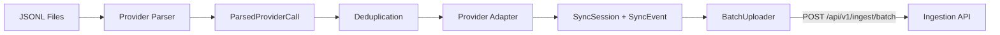
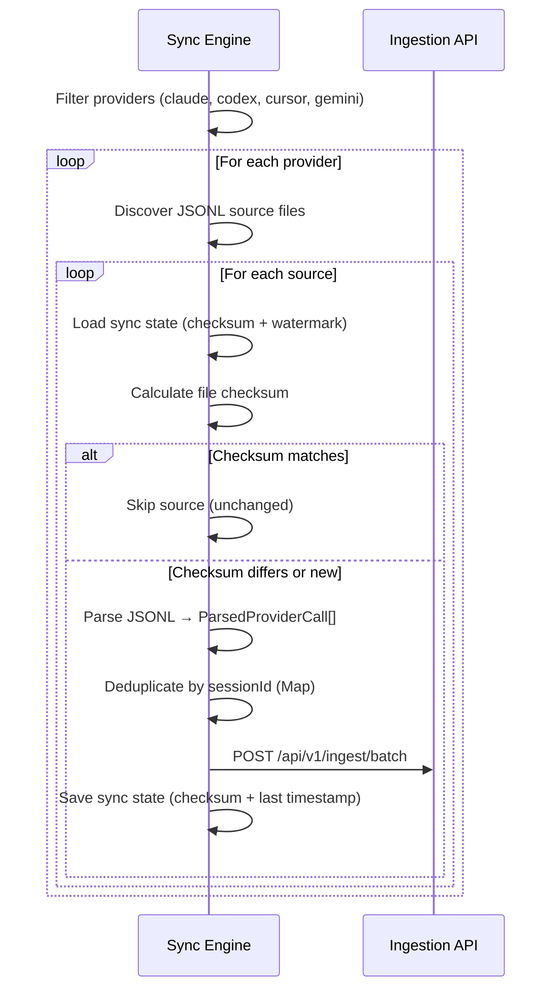
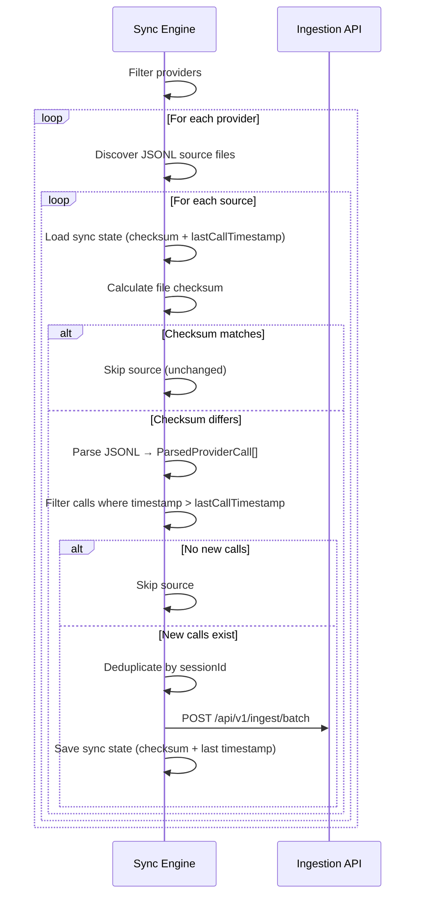
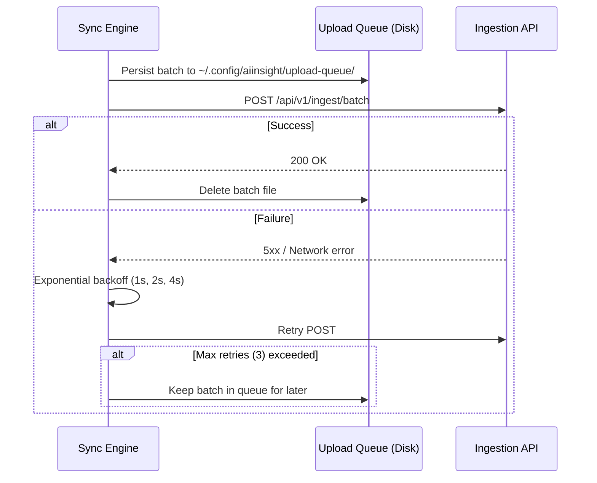

# Sync Engine

The sync engine runs on developer machines and uploads AI coding tool usage data to the cloud.

---

## Overview

---

## Sync Modes

### Historical Sync

Full scan of all available data. Used on first run or when data recovery is needed.

### Incremental Sync

Watermark-based. Only uploads calls with timestamps newer than the last synced call.

---

## Provider Adapters

Each provider has a parser (reads JSONL) and an adapter (normalizes to SyncSession/SyncEvent).

| Provider | Parser | Adapter | Cloud Sync |
|----------|--------|---------|------------|
| Claude | ✅ | ✅ `claudeAdapter` | ✅ |
| Codex | ✅ | ✅ `codexAdapter` | ✅ |
| Cursor | ✅ | ✅ `cursorAdapter` | ✅ |
| Gemini | ✅ | ✅ `geminiAdapter` | ✅ |
| Warp | ✅ | ❌ | ❌ |
| OpenCode | ✅ | ❌ | ❌ |

Warp and OpenCode have parsers for local CLI usage but no adapters for cloud sync.

See [provider-model.md](provider-model.md) for details on normalization.

---

## Batch Uploader

The `BatchUploader` handles reliable upload with durability and retry.

### Flow

### Configuration

| Parameter | Default | Description |
|-----------|---------|-------------|
| `batchSize` | 1000 | Events per batch |
| `maxRetries` | 3 | Maximum retry attempts |
| `baseDelayMs` | 1000 | Base delay for exponential backoff |

### Durability

- Batches are persisted to disk before upload
- On startup, the uploader loads queued batches from `~/.config/aiinsight/upload-queue/`
- Failed batches remain on disk for retry
- Successfully uploaded batches are deleted from disk

---

## Local Sync State

Stored as JSON files in `~/.config/aiinsight/sync-state/`.

### State Record

| Field | Purpose |
|-------|---------|
| `organizationId` | Tenant ID |
| `machineId` | Machine ID |
| `provider` | Provider name |
| `sourceIdentifier` | Source file path |
| `lastHash` | SHA-256 checksum of file contents |
| `lastCallTimestamp` | Timestamp of last synced call (watermark) |
| `lastProcessedAt` | When this source was last processed |

### Checksum Deduplication

Before parsing a source file, the sync engine calculates its SHA-256 checksum. If the checksum matches the stored state, the source is skipped. This prevents re-processing unchanged files.

### Watermark Deduplication

For incremental sync, the `lastCallTimestamp` watermark ensures only calls newer than the last synced call are uploaded. This is independent of the file checksum — a file can grow (new calls appended) without changing the checksum of existing content.

---

## Failure Recovery

| Failure | Recovery |
|---------|----------|
| Network error during upload | Exponential backoff retry, batch stays in queue |
| API returns 5xx | Exponential backoff retry |
| API returns 4xx (validation) | Batch is dropped, logged as error |
| Process killed mid-sync | Queue files on disk, loaded on next startup |
| Source file deleted | Sync state remains, source is skipped on next discovery |
| Provider parse error | Source is skipped, logged as error, other sources continue |

---

## Deduplication Strategy

Three layers prevent duplicates:

1. **File checksum**: Skips unchanged files entirely
2. **Timestamp watermark**: Filters out already-synced calls within changed files
3. **Database UPSERT**: `sessions` table has `UNIQUE(provider_id, external_session_id)` — re-uploading the same session is a no-op

Events have no database-level dedup constraint. The sync engine's watermark prevents duplicate event uploads in normal operation.
