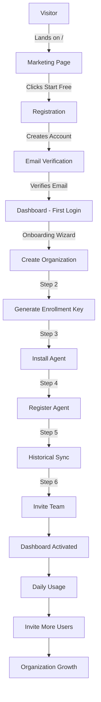
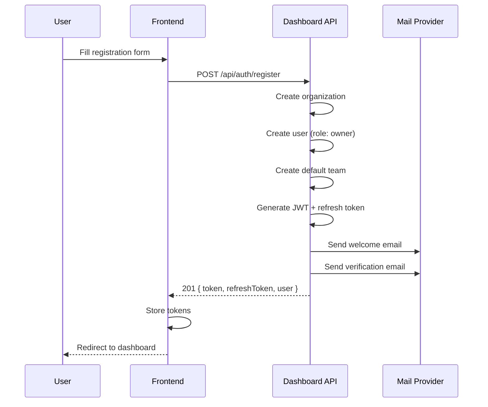
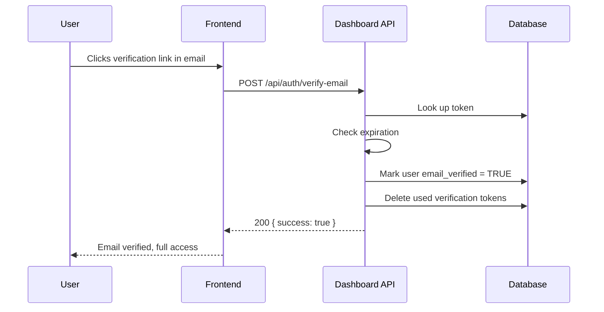
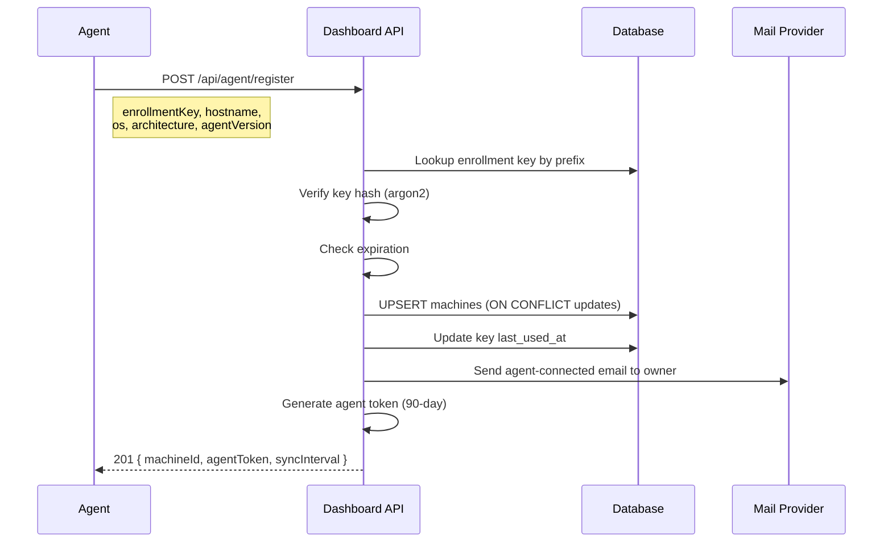
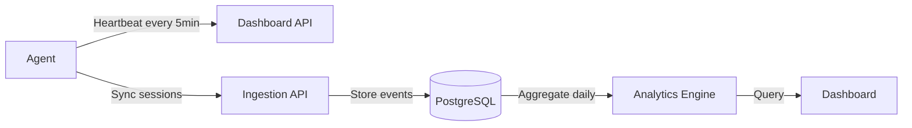
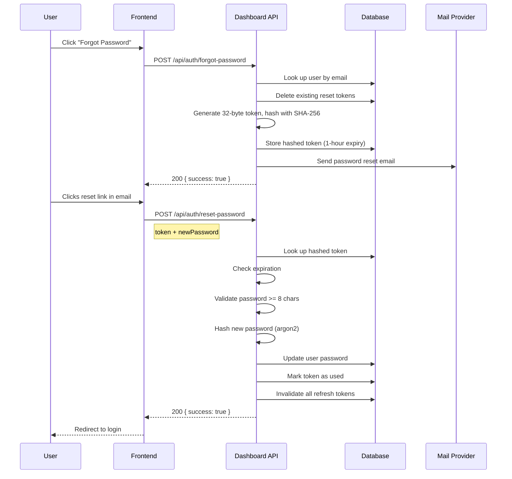
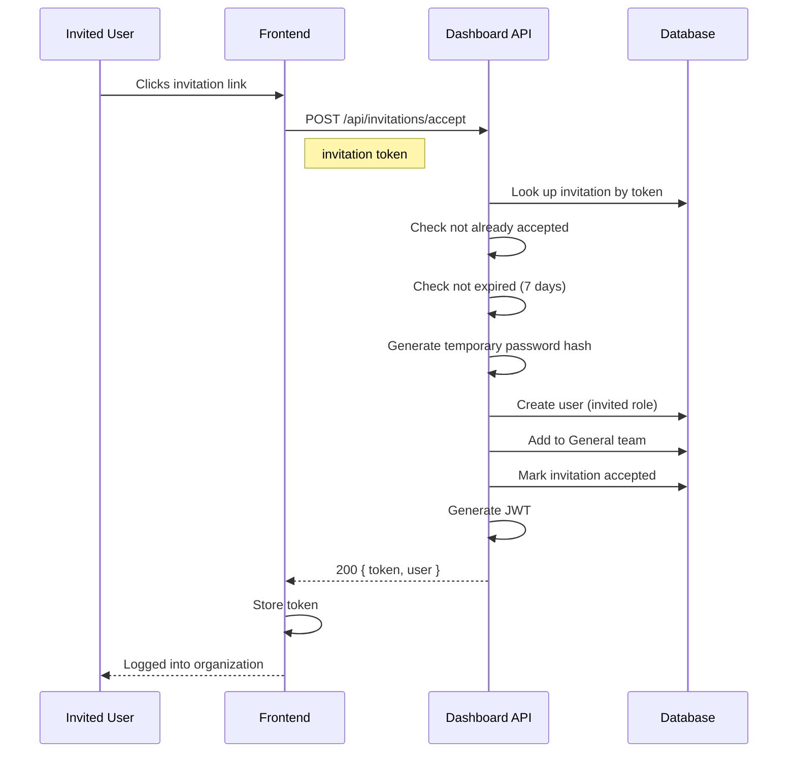

# User Journey

Complete user lifecycle from visitor to active customer.

---

## Journey Overview

---

## Stage 1: Visitor

**Goal:** Understand AIInsight's value proposition

**Touchpoints:**
- Marketing page (landing page)
- Documentation
- Blog/content

**User Actions:**
- Reads about AI analytics features
- Reviews pricing/plans
- Clicks "Start Free" or "Get Started"

**Success Metric:** Visitor clicks registration CTA

---

## Stage 2: Signup

**Goal:** Create an account and organization

**Sequence Diagram:**

**Fields Required:**
- Email (required, unique)
- Password (required, min 8 characters)
- Name (optional)
- Organization Name (required)

**Backend Actions (auth.controller.ts:4-28):**
1. Validate input fields
2. Check password length >= 8
3. Call `dashboardService.register()`
4. Create organization and settings
5. Create user with `owner` role
6. Create default "General" team
7. Generate email verification token
8. Send welcome email
9. Return JWT + refresh token

**What Gets Created:**
- Organization record
- Organization settings (default timezone, currency, retention)
- User record (role: `owner`)
- Default team ("General")
- Team membership (user as `admin` of General team)
- Refresh token (30-day expiry)
- Email verification token (24-hour expiry)

---

## Stage 3: Email Verification

**Goal:** Verify email address to activate account

**Sequence Diagram:**

**Token Flow:**
- Token generated: 32-byte random hex
- Stored in `email_verifications` table
- Expires after 24 hours
- Single-use (deleted after verification)

**Resend Verification:**
- `POST /api/auth/resend-verification` with email
- Deletes old tokens, generates new one
- Returns success regardless of whether user exists

---

## Stage 4: First Login & Onboarding

**Goal:** Complete initial setup through wizard

**Onboarding Steps:**

| Step | Action | Database Check |
|------|--------|----------------|
| 1 | Organization created | `organizations` row exists |
| 2 | Generate enrollment key | `organization_enrollment_keys` has rows |
| 3 | Install agent on machine | Agent binary downloaded |
| 4 | Register agent | `machines` row created |
| 5 | Historical sync | `sync_jobs` with `status = 'completed'` |
| 6 | Invite team members | `organization_invitations` has rows |

**Agent Registration Flow:**

**Enrollment Key Format:**
- Prefix: `ai_live_` + 8 hex chars (e.g., `ai_live_a1b2c3d4`)
- Full key: prefix + 48 hex chars
- Stored as argon2 hash in database
- Expiration: configurable (default: no expiry)

---

## Stage 5: Activation

**Goal:** See first data in dashboard

**Data Flow:**

**Dashboard Metrics Available:**
- Total sessions, users, tokens, cost
- Provider breakdown (OpenAI, Anthropic, etc.)
- Model usage analytics
- User-level usage
- Project-level usage
- Trend charts (daily/weekly/monthly)

**Period Options:** `24h`, `7d`, `30d`, `90d`, `1y`

---

## Stage 6: Adoption

**Goal:** Regular usage and team expansion

**Key Activities:**
- Daily dashboard review
- Inviting additional team members
- Adding more machines/agents
- Exploring analytics features
- Setting up integrations

**Team Management:**
- Roles: `owner`, `admin`, `member`
- Teams for grouping users
- Invitations with 7-day expiry

---

## Stage 7: Growth

**Goal:** Scale across organization

**Expansion Indicators:**
- Multiple machines registered
- Multiple teams created
- Advanced analytics usage
- API integrations
- High daily active usage

**Scaling Considerations:**
- Enrollment key management (rotation, multiple keys)
- Agent version management across machines
- Data retention policies
- Cost optimization through analytics

---

## Key Interactions

### Password Reset Flow

### Invitation Accept Flow

---

## Lifecycle Metrics

| Stage | Key Metric | Target |
|-------|-----------|--------|
| Visitor | CTA click rate | > 5% |
| Signup | Registration completion | > 80% of started |
| Verification | Email verification rate | > 70% |
| Onboarding | Wizard completion | > 60% |
| Activation | First data in dashboard | Within 24 hours |
| Adoption | Weekly active users | > 50% of registered |
| Growth | Team size increase | > 2 members avg |
