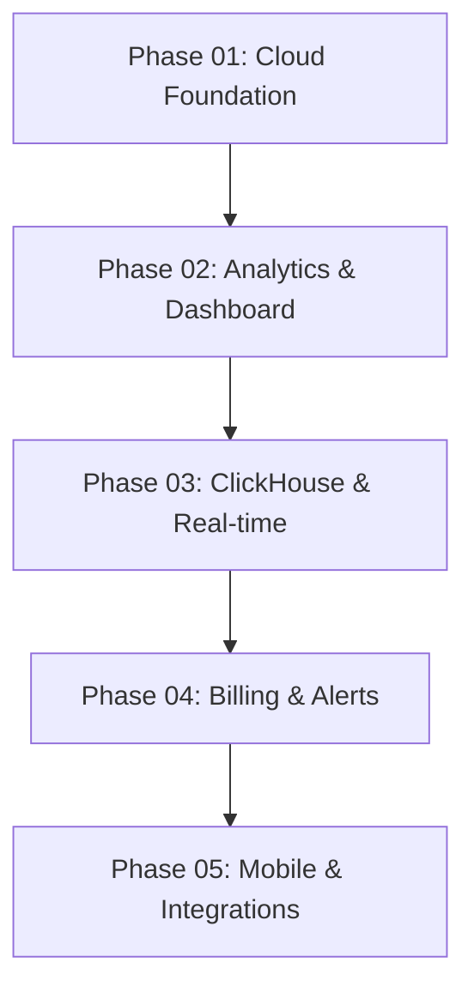

# AiInsight Cloud Roadmap

## Overview

AiInsight Cloud is being built in phases to enable team collaboration, centralized analytics, and enterprise features for AI coding cost management.

## Phase Status

| Phase | Name | Status | Documentation |
|-------|------|--------|---------------|
| 01 | Cloud Foundation | ✅ Complete | [phase-01-cloud-foundation.md](phases/phase-01-cloud-foundation.md) |
| 02 | Analytics & Dashboard | ✅ Complete | [phase-02-analytics-dashboard.md](phases/phase-02-analytics-dashboard.md) |
| 03 | Organization Onboarding & Tenant Management | ✅ Complete | [phase-03-org-onboarding.md](phases/phase-03-org-onboarding.md) |
| 04 | ClickHouse & Real-time | 📋 Planned | - |
| 05 | Billing & Alerts | 📋 Planned | - |
| 06 | Mobile & Integrations | 📋 Planned | - |

## Phase Details

### Phase 01: Cloud Foundation ✅

**Goal:** Enable data synchronization from local machines to cloud.

**Deliverables:**
- `@aiinsight/sync-engine` - Client-side sync library
- `@aiinsight/ingestion-api` - Multi-tenant REST API
- PostgreSQL schema (organizations, users, machines, sessions, events)
- Provider adapters for Claude, Codex, Cursor, Gemini
- Batch upload with local queue persistence
- Exponential backoff retry logic

**Duration:** 2 weeks
**Dependencies:** None

### Phase 02: Analytics & Dashboard Foundation ✅

**Goal:** Enable analytics visualization and team dashboard.

**Deliverables:**
- `@aiinsight/analytics-engine` - Core aggregation library
- `@aiinsight/dashboard-api` - REST API for analytics
- `@aiinsight/dashboard-web` - Next.js 15 web dashboard
- 7 database migrations (aggregation tables + auth)
- JWT + API key dual authentication
- 7 dashboard pages with charts and tables

**Duration:** 2 weeks
**Dependencies:** Phase 01

### Phase 03: Organization Onboarding & Tenant Management ✅

**Goal:** Transform AiInsight into a self-service SaaS product with full tenant lifecycle management.

**Deliverables:**
- User registration and login with JWT + refresh token rotation
- Organization management with settings
- Team management with role-based membership
- Invitation system with token-based flow
- Agent enrollment key system
- Machine registration and heartbeat tracking
- Onboarding wizard for new organizations
- Ingestion API authentication middleware
- Enhanced dashboard with org overview, agent status, sync jobs
- Seed data system for development

**Duration:** 2 weeks
**Dependencies:** Phase 02

### Phase 04: ClickHouse & Real-time (Planned)

**Goal:** Enable high-scale analytics and real-time updates.

**Deliverables:**
- ClickHouse integration for fast analytical queries
- Real-time WebSocket updates for live dashboard
- Data export API (CSV/JSON)
- OpenAPI documentation for Dashboard API
- Rate limiting per tenant
- API key rotation
- Token refresh rotation

**Duration:** 3 weeks
**Dependencies:** Phase 02

**Key Decisions:**
- [ADR-007] ClickHouse for high-scale analytics
- [ADR-008] WebSocket for real-time updates

### Phase 04: Billing & Alerts (Planned)

**Goal:** Enable billing integration and cost alerts.

**Deliverables:**
- Billing integration (usage-based billing)
- Cost threshold alerts
- Invoice generation
- Audit logging
- Row-level security (RLS) policies

**Duration:** 3 weeks
**Dependencies:** Phase 03

**Key Decisions:**
- [ADR-009] Billing integration approach
- [ADR-010] Alerting system design

### Phase 05: Mobile & Integrations (Planned)

**Goal:** Enable mobile access and team integrations.

**Deliverables:**
- Mobile app (iOS/Android)
- Slack/Teams integration
- Multi-region deployment
- Advanced analytics (ML-powered insights)

**Duration:** 4 weeks
**Dependencies:** Phase 04

**Key Decisions:**
- [ADR-011] Mobile app framework
- [ADR-012] Integration architecture

## Dependencies Between Phases

## Milestones

### Milestone 1: Data Ingestion (Phase 01)
- [x] Sync engine discovers and parses provider sessions
- [x] Ingestion API receives and stores events
- [x] Multi-tenant isolation implemented
- [x] Provider adapters for Claude, Codex, Cursor, Gemini

### Milestone 2: Analytics Dashboard (Phase 02)
- [x] Analytics engine aggregates daily usage
- [x] Dashboard API serves pre-aggregated data
- [x] Web dashboard with charts and tables
- [x] JWT + API key authentication

### Milestone 3: Organization Onboarding (Phase 03)
- [x] User registration and login with JWT
- [x] Organization management with settings
- [x] Team management with roles
- [x] Invitation system with tokens
- [x] Agent enrollment key system
- [x] Machine registration and heartbeat
- [x] Onboarding wizard
- [x] Ingestion API auth middleware
- [x] Seed data system

### Milestone 4: High-Scale Analytics (Phase 04)
- [ ] ClickHouse integration for fast queries
- [ ] Real-time WebSocket updates
- [ ] Data export API
- [ ] Rate limiting and API key rotation

### Milestone 5: Billing Integration (Phase 05)
- [ ] Usage-based billing
- [ ] Cost threshold alerts
- [ ] Invoice generation
- [ ] Audit logging

### Milestone 6: Mobile & Integrations (Phase 06)
- [ ] Mobile app (iOS/Android)
- [ ] Slack/Teams integration
- [ ] Multi-region deployment

## Success Criteria

### Phase 01 Success
- Sync engine successfully uploads sessions from local machines
- Ingestion API stores events with < 1% data loss
- Multi-tenant isolation prevents cross-org data access

### Phase 02 Success
- Dashboard loads in < 500ms
- Overview queries return in < 250ms
- Authentication works for both JWT and API keys
- Historical backfill completes for 90 days of data

### Phase 03 Success
- User can register and login without manual database operations
- Organization creation creates default team and settings
- Enrollment keys can be generated, listed, revoked, and rotated
- Agent registration works end-to-end with enrollment key
- Machine heartbeat updates last_seen and status
- Invitation flow generates token and accepts new users
- Seed script creates complete test environment
- All API endpoints return correct data with proper auth

### Phase 04 Success
- ClickHouse queries return in < 100ms
- Real-time updates propagate within 5 seconds
- Data export generates CSV/JSON without timeout
- Rate limiting prevents abuse

### Phase 04 Success
- Billing integration calculates usage costs accurately
- Alerts trigger within 1 minute of threshold breach
- Invoices generated correctly for all billing periods

### Phase 05 Success
- Mobile app available on iOS and Android
- Slack/Teams integration posts daily summaries
- Multi-region deployment achieves 99.9% uptime

## Risk Assessment

### High Risk
| Risk | Impact | Mitigation |
|------|--------|------------|
| ClickHouse complexity | Phase 03 delay | Start with PostgreSQL, migrate later |
| Mobile app development | Phase 05 delay | Use React Native for code reuse |
| Billing integration | Phase 04 delay | Partner with billing provider early |

### Medium Risk
| Risk | Impact | Mitigation |
|------|--------|------------|
| Real-time performance | Dashboard lag | WebSocket with fallback to polling |
| Multi-region sync | Data consistency | Eventually consistent model |
| Team adoption | Low usage | Focus on onboarding experience |

### Low Risk
| Risk | Impact | Mitigation |
|------|--------|------------|
| API versioning | Breaking changes | Semantic versioning |
| Database migrations | Data loss | Automated backups |
| Security vulnerabilities | Data breach | Regular security audits |

## Resource Requirements

### Phase 03
- 1 backend engineer (ClickHouse integration)
- 1 frontend engineer (real-time updates)
- DevOps support for ClickHouse deployment

### Phase 04
- 1 backend engineer (billing integration)
- 1 frontend engineer (billing dashboard)
- Legal review for billing terms

### Phase 05
- 1 mobile engineer (iOS/Android)
- 1 backend engineer (integrations)
- DevOps support for multi-region

## Timeline

| Phase | Start | End | Duration |
|-------|-------|-----|----------|
| 01 | 2026-06-01 | 2026-06-14 | 2 weeks |
| 02 | 2026-06-15 | 2026-06-28 | 2 weeks |
| 03 | 2026-07-01 | 2026-07-21 | 3 weeks |
| 04 | 2026-07-22 | 2026-08-11 | 3 weeks |
| 05 | 2026-08-12 | 2026-09-08 | 4 weeks |

## Next Steps

1. **Immediate (Phase 03):**
   - Evaluate ClickHouse vs PostgreSQL for analytics
   - Design WebSocket protocol for real-time updates
   - Plan data export API

2. **Short-term (Phase 04):**
   - Research billing providers (Stripe, Paddle)
   - Design alerting system
   - Plan audit logging schema

3. **Long-term (Phase 05):**
   - Evaluate mobile frameworks (React Native, Flutter)
   - Design integration architecture
   - Plan multi-region deployment

---

*Document generated: 2026-06-12*
*Last updated: 2026-06-12*